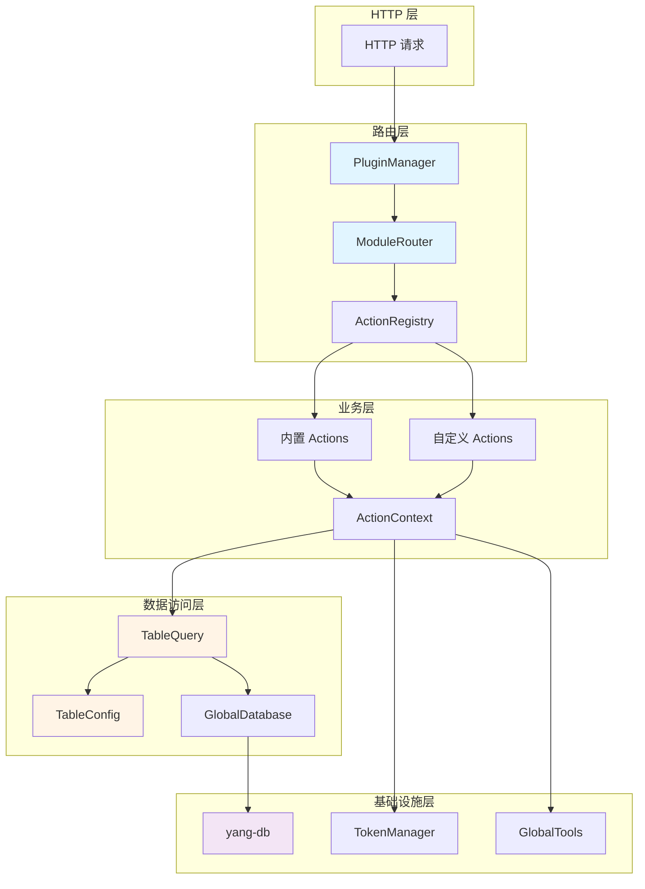
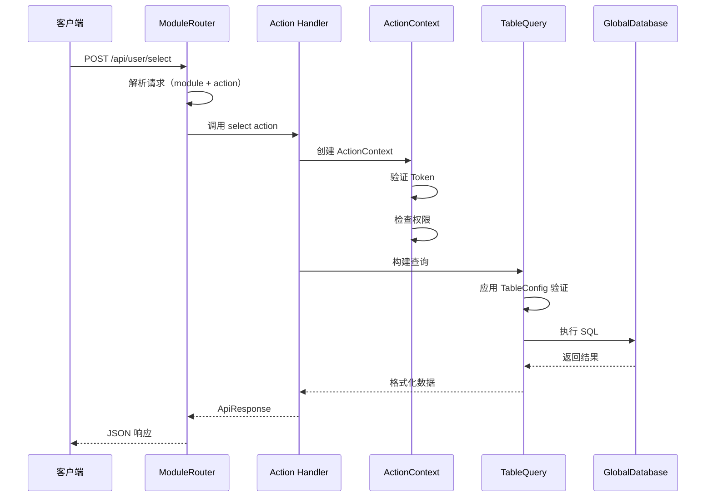
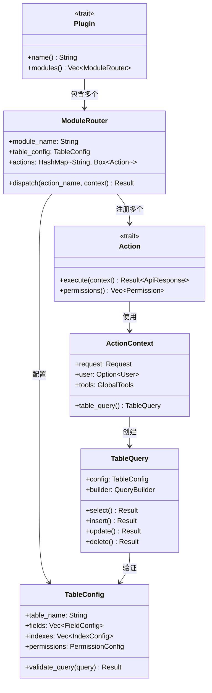

# 设计文档：模块表路由系统 - 第1部分：概述与架构

## 1. 概述

模块表路由系统是 yang-base 库的核心扩展，为基于插件的 Rust 后端应用提供完整的数据表管理、查询构建和路由分发能力。该系统参考 scs-api 的三层架构（addon → module → action），但采用更类型安全的设计，充分利用 Rust 的类型系统和 trait 机制。

### 1.1 系统目标

- **类型安全**：使用 Rust 类型系统替代字符串匹配，编译期捕获错误
- **声明式配置**：通过 TableConfig 声明表结构，自动生成 CRUD 操作
- **可扩展性**：支持自定义 action、字段类型、验证规则
- **权限控制**：集成 RBAC，支持 action 级和字段级权限
- **统一接口**：标准化的请求/响应格式，简化前后端对接

### 1.2 核心功能

1. **表配置系统（TableConfig）**：声明式定义数据表元数据、字段、索引和权限
2. **统一查询接口（TableQuery）**：基于 yang-db 的类型安全查询构建器，支持 CRUD、筛选、排序、分页
3. **模块路由系统（ModuleRouter）**：类型安全的 action 路由机制，支持内置和自定义操作
4. **权限认证集成**：与 TokenManager 集成，提供 RBAC 和字段级权限控制
5. **全局工具扩展**：可扩展的全局工具注册机制（数据库、缓存、消息队列等）

## 2. 架构设计

### 2.1 系统架构图



### 2.2 数据流序列图



### 2.3 组件关系图



## 3. 核心组件设计

### 3.1 Plugin Trait 扩展

扩展现有的 Plugin trait，添加模块路由支持：

```rust
#[async_trait]
pub trait Plugin: Send + Sync {
    // ... 现有方法 ...
    
    /// 获取模块路由列表
    ///
    /// 每个插件可以包含多个模块，每个模块对应一张表或一组相关功能
    ///
    /// # 返回
    /// - 模块路由列表
    fn modules(&self) -> Vec<ModuleRouter> {
        Vec::new()
    }
}
```

### 3.2 ModuleRouter 结构

模块路由器负责管理单个模块的所有 action：

```rust
/// 模块路由器
///
/// 管理单个模块的表配置和 action 路由
pub struct ModuleRouter {
    /// 模块名称（唯一标识）
    module_name: String,
    
    /// 模块显示名称
    display_name: String,
    
    /// 表配置（可选，某些模块可能不对应数据表）
    table_config: Option<Arc<TableConfig>>,
    
    /// 注册的 actions
    actions: HashMap<String, Box<dyn Action>>,
    
    /// 默认权限要求
    default_permissions: Vec<Permission>,
}

impl ModuleRouter {
    /// 创建新的模块路由器
    pub fn new(module_name: impl Into<String>) -> Self {
        Self {
            module_name: module_name.into(),
            display_name: String::new(),
            table_config: None,
            actions: HashMap::new(),
            default_permissions: Vec::new(),
        }
    }
    
    /// 设置显示名称
    pub fn display_name(mut self, name: impl Into<String>) -> Self {
        self.display_name = name.into();
        self
    }
    
    /// 设置表配置
    pub fn table_config(mut self, config: TableConfig) -> Self {
        self.table_config = Some(Arc::new(config));
        self
    }
    
    /// 注册 action
    pub fn register_action<A: Action + 'static>(
        mut self,
        name: impl Into<String>,
        action: A,
    ) -> Self {
        self.actions.insert(name.into(), Box::new(action));
        self
    }
    
    /// 注册内置 CRUD actions
    pub fn register_builtin_actions(mut self) -> Self {
        if let Some(config) = &self.table_config {
            self = self
                .register_action("add", AddAction::new(config.clone()))
                .register_action("put", PutAction::new(config.clone()))
                .register_action("del", DelAction::new(config.clone()))
                .register_action("get", GetAction::new(config.clone()))
                .register_action("select", SelectAction::new(config.clone()))
                .register_action("table", TableAction::new(config.clone()));
        }
        self
    }
    
    /// 分发请求到对应的 action
    pub async fn dispatch(
        &self,
        action_name: &str,
        context: ActionContext,
    ) -> Result<ApiResponse, BaseError> {
        let action = self
            .actions
            .get(action_name)
            .ok_or_else(|| BaseError::ActionNotFound(action_name.to_string()))?;
        
        // 检查权限
        self.check_permissions(&context, action.permissions()).await?;
        
        // 执行 action
        action.execute(context).await
    }
    
    /// 检查权限
    async fn check_permissions(
        &self,
        context: &ActionContext,
        action_permissions: &[Permission],
    ) -> Result<(), BaseError> {
        // 合并默认权限和 action 权限
        let required_permissions: Vec<_> = self
            .default_permissions
            .iter()
            .chain(action_permissions.iter())
            .collect();
        
        // 验证用户权限
        if let Some(user) = &context.user {
            for permission in required_permissions {
                if !user.has_permission(permission) {
                    return Err(BaseError::PermissionDenied(permission.to_string()));
                }
            }
        } else if !required_permissions.is_empty() {
            return Err(BaseError::Unauthorized);
        }
        
        Ok(())
    }
}
```
