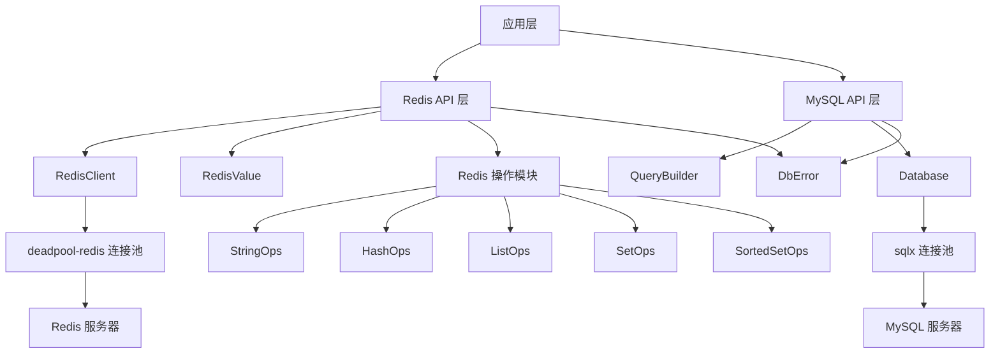
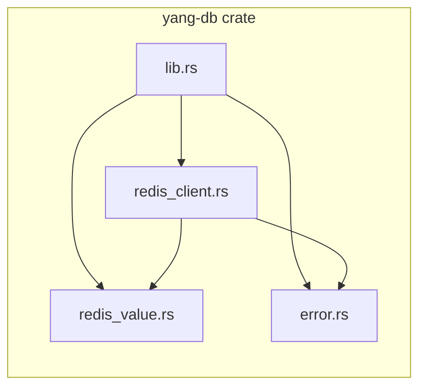
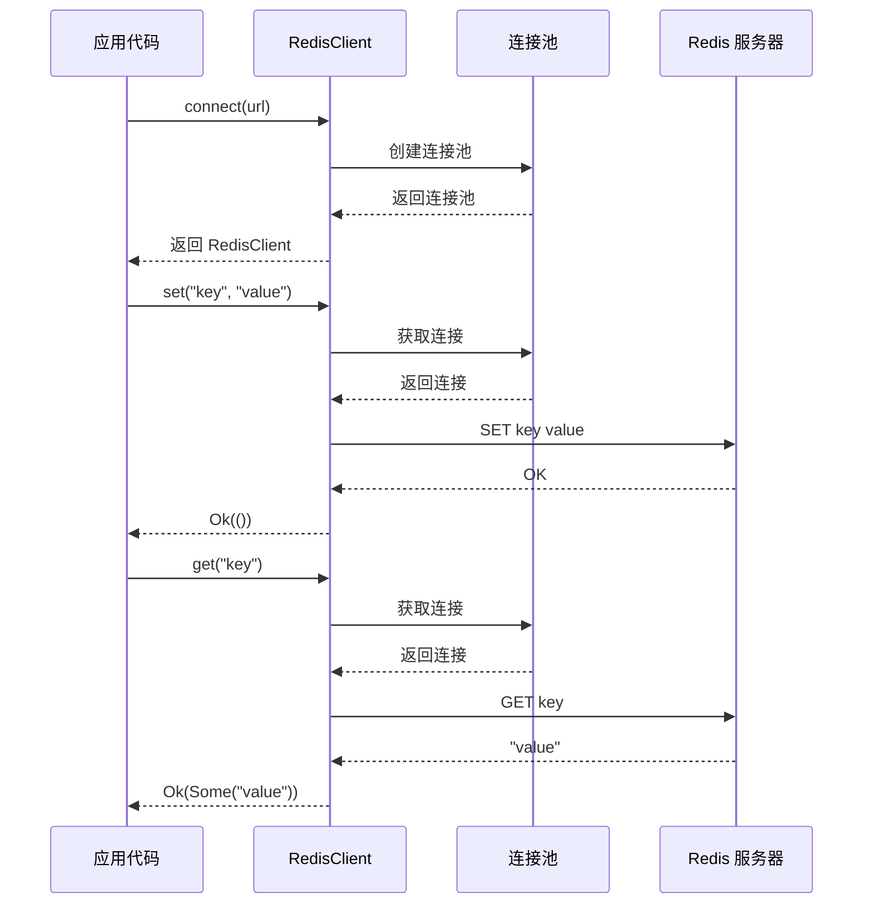

# 设计文档: Redis 操作功能

## 概述

为 yang-db 数据库基础库添加 Redis 数据库操作支持。yang-db 目前主要支持 MySQL 操作，本设计将扩展其功能以支持 Redis 键值存储操作。设计目标是提供类型安全、异步、易用的 Redis API，与现有 MySQL 操作保持一致的设计风格和错误处理机制。

核心特性包括：
- 基于 deadpool-redis 的连接池管理
- 支持 Redis 五大数据类型（String、Hash、List、Set、Sorted Set）
- 类型安全的 API 设计，防止运行时错误
- 统一的错误处理，集成到现有 DbError 体系
- 完全异步操作，基于 tokio 运行时
- 中文注释和错误消息

## 架构设计

### 系统架构图



### 模块组件图



**说明**: 简化的模块结构，所有 Redis 操作直接在 `RedisClient` 中实现，无需额外的 Ops 结构体。

### 数据流图



## 核心组件和接口

### 组件 1: RedisClient

**目的**: Redis 客户端管理器，负责连接池管理和提供操作入口

**接口**:
```rust
/// Redis 客户端
pub struct RedisClient {
    pool: deadpool_redis::Pool,
    config: RedisConfig,
}

impl RedisClient {
    /// 连接到 Redis 服务器
    pub async fn connect(url: &str) -> Result<Self, DbError>;
    
    /// 使用自定义配置连接
    pub async fn connect_with_config(url: &str, config: RedisConfig) -> Result<Self, DbError>;
    
    /// 获取连接池引用
    pub fn pool(&self) -> &deadpool_redis::Pool;
    
    /// 执行原生 Redis 命令
    pub async fn execute(&self, cmd: &redis::Cmd) -> Result<RedisValue, DbError>;
    
    // ==================== String 操作 ====================
    
    /// SET - 设置键值
    pub async fn set(&self, key: impl Into<String>, value: impl Into<RedisValue>) -> Result<(), DbError>;
    
    /// GET - 获取键值
    pub async fn get(&self, key: impl Into<String>) -> Result<Option<RedisValue>, DbError>;
    
    /// SETEX - 设置键值并指定过期时间（秒）
    pub async fn setex(&self, key: impl Into<String>, value: impl Into<RedisValue>, seconds: u64) -> Result<(), DbError>;
    
    /// SETNX - 仅当键不存在时设置
    pub async fn setnx(&self, key: impl Into<String>, value: impl Into<RedisValue>) -> Result<bool, DbError>;
    
    /// GETSET - 设置新值并返回旧值
    pub async fn getset(&self, key: impl Into<String>, value: impl Into<RedisValue>) -> Result<Option<RedisValue>, DbError>;
    
    /// MGET - 批量获取
    pub async fn mget(&self, keys: Vec<impl Into<String>>) -> Result<Vec<Option<RedisValue>>, DbError>;
    
    /// MSET - 批量设置
    pub async fn mset(&self, pairs: Vec<(impl Into<String>, impl Into<RedisValue>)>) -> Result<(), DbError>;
    
    /// INCR - 整数自增
    pub async fn incr(&self, key: impl Into<String>) -> Result<i64, DbError>;
    
    /// INCRBY - 整数增加指定值
    pub async fn incrby(&self, key: impl Into<String>, increment: i64) -> Result<i64, DbError>;
    
    /// DECR - 整数自减
    pub async fn decr(&self, key: impl Into<String>) -> Result<i64, DbError>;
    
    /// DECRBY - 整数减少指定值
    pub async fn decrby(&self, key: impl Into<String>, decrement: i64) -> Result<i64, DbError>;
    
    /// APPEND - 追加字符串
    pub async fn append(&self, key: impl Into<String>, value: impl Into<String>) -> Result<i64, DbError>;
    
    /// STRLEN - 获取字符串长度
    pub async fn strlen(&self, key: impl Into<String>) -> Result<i64, DbError>;
    
    // ==================== Hash 操作 ====================
    
    /// HSET - 设置哈希字段
    pub async fn hset(&self, key: impl Into<String>, field: impl Into<String>, value: impl Into<RedisValue>) -> Result<bool, DbError>;
    
    /// HGET - 获取哈希字段
    pub async fn hget(&self, key: impl Into<String>, field: impl Into<String>) -> Result<Option<RedisValue>, DbError>;
    
    /// HMSET - 批量设置哈希字段
    pub async fn hmset(&self, key: impl Into<String>, fields: Vec<(impl Into<String>, impl Into<RedisValue>)>) -> Result<(), DbError>;
    
    /// HMGET - 批量获取哈希字段
    pub async fn hmget(&self, key: impl Into<String>, fields: Vec<impl Into<String>>) -> Result<Vec<Option<RedisValue>>, DbError>;
    
    /// HGETALL - 获取所有字段和值
    pub async fn hgetall(&self, key: impl Into<String>) -> Result<Vec<(String, RedisValue)>, DbError>;
    
    /// HDEL - 删除哈希字段
    pub async fn hdel(&self, key: impl Into<String>, fields: Vec<impl Into<String>>) -> Result<i64, DbError>;
    
    /// HEXISTS - 检查字段是否存在
    pub async fn hexists(&self, key: impl Into<String>, field: impl Into<String>) -> Result<bool, DbError>;
    
    /// HLEN - 获取哈希字段数量
    pub async fn hlen(&self, key: impl Into<String>) -> Result<i64, DbError>;
    
    /// HKEYS - 获取所有字段名
    pub async fn hkeys(&self, key: impl Into<String>) -> Result<Vec<String>, DbError>;
    
    /// HVALS - 获取所有值
    pub async fn hvals(&self, key: impl Into<String>) -> Result<Vec<RedisValue>, DbError>;
    
    /// HINCRBY - 整数字段增加
    pub async fn hincrby(&self, key: impl Into<String>, field: impl Into<String>, increment: i64) -> Result<i64, DbError>;
    
    /// HINCRBYFLOAT - 浮点数字段增加
    pub async fn hincrbyfloat(&self, key: impl Into<String>, field: impl Into<String>, increment: f64) -> Result<f64, DbError>;
    
    // ==================== List 操作 ====================
    
    /// LPUSH - 从左侧推入元素
    pub async fn lpush(&self, key: impl Into<String>, values: Vec<impl Into<RedisValue>>) -> Result<i64, DbError>;
    
    /// RPUSH - 从右侧推入元素
    pub async fn rpush(&self, key: impl Into<String>, values: Vec<impl Into<RedisValue>>) -> Result<i64, DbError>;
    
    /// LPOP - 从左侧弹出元素
    pub async fn lpop(&self, key: impl Into<String>) -> Result<Option<RedisValue>, DbError>;
    
    /// RPOP - 从右侧弹出元素
    pub async fn rpop(&self, key: impl Into<String>) -> Result<Option<RedisValue>, DbError>;
    
    /// LRANGE - 获取范围内的元素
    pub async fn lrange(&self, key: impl Into<String>, start: i64, stop: i64) -> Result<Vec<RedisValue>, DbError>;
    
    /// LLEN - 获取列表长度
    pub async fn llen(&self, key: impl Into<String>) -> Result<i64, DbError>;
    
    /// LINDEX - 获取指定索引的元素
    pub async fn lindex(&self, key: impl Into<String>, index: i64) -> Result<Option<RedisValue>, DbError>;
    
    /// LSET - 设置指定索引的元素
    pub async fn lset(&self, key: impl Into<String>, index: i64, value: impl Into<RedisValue>) -> Result<(), DbError>;
    
    /// LTRIM - 修剪列表
    pub async fn ltrim(&self, key: impl Into<String>, start: i64, stop: i64) -> Result<(), DbError>;
    
    // ==================== Set 操作 ====================
    
    /// SADD - 添加成员
    pub async fn sadd(&self, key: impl Into<String>, members: Vec<impl Into<RedisValue>>) -> Result<i64, DbError>;
    
    /// SREM - 删除成员
    pub async fn srem(&self, key: impl Into<String>, members: Vec<impl Into<RedisValue>>) -> Result<i64, DbError>;
    
    /// SMEMBERS - 获取所有成员
    pub async fn smembers(&self, key: impl Into<String>) -> Result<Vec<RedisValue>, DbError>;
    
    /// SISMEMBER - 检查成员是否存在
    pub async fn sismember(&self, key: impl Into<String>, member: impl Into<RedisValue>) -> Result<bool, DbError>;
    
    /// SCARD - 获取集合大小
    pub async fn scard(&self, key: impl Into<String>) -> Result<i64, DbError>;
    
    /// SPOP - 随机弹出成员
    pub async fn spop(&self, key: impl Into<String>, count: Option<i64>) -> Result<Vec<RedisValue>, DbError>;
    
    /// SRANDMEMBER - 随机获取成员（不删除）
    pub async fn srandmember(&self, key: impl Into<String>, count: Option<i64>) -> Result<Vec<RedisValue>, DbError>;
    
    // ==================== Sorted Set 操作 ====================
    
    /// ZADD - 添加成员及分数
    pub async fn zadd(&self, key: impl Into<String>, members: Vec<(f64, impl Into<RedisValue>)>) -> Result<i64, DbError>;
    
    /// ZREM - 删除成员
    pub async fn zrem(&self, key: impl Into<String>, members: Vec<impl Into<RedisValue>>) -> Result<i64, DbError>;
    
    /// ZSCORE - 获取成员分数
    pub async fn zscore(&self, key: impl Into<String>, member: impl Into<RedisValue>) -> Result<Option<f64>, DbError>;
    
    /// ZRANGE - 按索引范围获取成员
    pub async fn zrange(&self, key: impl Into<String>, start: i64, stop: i64, with_scores: bool) -> Result<Vec<RedisValue>, DbError>;
    
    /// ZRANGEBYSCORE - 按分数范围获取成员
    pub async fn zrangebyscore(&self, key: impl Into<String>, min: f64, max: f64, with_scores: bool) -> Result<Vec<RedisValue>, DbError>;
    
    /// ZCARD - 获取有序集合大小
    pub async fn zcard(&self, key: impl Into<String>) -> Result<i64, DbError>;
    
    /// ZCOUNT - 统计分数范围内的成员数量
    pub async fn zcount(&self, key: impl Into<String>, min: f64, max: f64) -> Result<i64, DbError>;
    
    /// ZINCRBY - 增加成员分数
    pub async fn zincrby(&self, key: impl Into<String>, increment: f64, member: impl Into<RedisValue>) -> Result<f64, DbError>;
    
    // ==================== 通用键操作 ====================
    
    /// DEL - 删除键
    pub async fn del(&self, keys: Vec<impl Into<String>>) -> Result<i64, DbError>;
    
    /// EXISTS - 检查键是否存在
    pub async fn exists(&self, keys: Vec<impl Into<String>>) -> Result<i64, DbError>;
    
    /// EXPIRE - 设置过期时间（秒）
    pub async fn expire(&self, key: impl Into<String>, seconds: u64) -> Result<bool, DbError>;
    
    /// TTL - 获取剩余生存时间（秒）
    pub async fn ttl(&self, key: impl Into<String>) -> Result<i64, DbError>;
    
    /// PERSIST - 移除过期时间
    pub async fn persist(&self, key: impl Into<String>) -> Result<bool, DbError>;
    
    /// KEYS - 查找匹配模式的键
    pub async fn keys(&self, pattern: impl Into<String>) -> Result<Vec<String>, DbError>;
}
```

**职责**:
- 管理 Redis 连接池生命周期
- 提供各数据类型操作的入口
- 执行原生 Redis 命令
- 处理连接获取和释放

### 组件 2: RedisConfig

**目的**: Redis 连接配置

**接口**:
```rust
/// Redis 配置
#[derive(Debug, Clone)]
pub struct RedisConfig {
    /// 最大连接数
    pub max_connections: usize,
    /// 连接超时时间（秒）
    pub connect_timeout: u64,
    /// 等待连接超时时间（秒）
    pub wait_timeout: u64,
    /// 是否启用日志
    pub enable_logging: bool,
}

impl Default for RedisConfig {
    fn default() -> Self;
}
```

### 组件 3: RedisValue

**目的**: Redis 值类型的 Rust 表示

**接口**:
```rust
/// Redis 值类型
#[derive(Debug, Clone, PartialEq)]
pub enum RedisValue {
    /// 空值
    Nil,
    /// 整数
    Int(i64),
    /// 浮点数
    Float(f64),
    /// 字符串
    String(String),
    /// 字节数组
    Bytes(Vec<u8>),
    /// 数组
    Array(Vec<RedisValue>),
    /// 布尔值
    Bool(bool),
}

impl RedisValue {
    /// 转换为字符串
    pub fn as_string(&self) -> Option<String>;
    
    /// 转换为整数
    pub fn as_i64(&self) -> Option<i64>;
    
    /// 转换为浮点数
    pub fn as_f64(&self) -> Option<f64>;
    
    /// 转换为布尔值
    pub fn as_bool(&self) -> Option<bool>;
    
    /// 转换为字节数组
    pub fn as_bytes(&self) -> Option<&[u8]>;
    
    /// 转换为数组
    pub fn as_array(&self) -> Option<&[RedisValue]>;
    
    /// 是否为 Nil
    pub fn is_nil(&self) -> bool;
}

// 实现 From trait 支持自动转换
impl From<String> for RedisValue;
impl From<&str> for RedisValue;
impl From<i64> for RedisValue;
impl From<i32> for RedisValue;
impl From<f64> for RedisValue;
impl From<bool> for RedisValue;
impl From<Vec<u8>> for RedisValue;
```

### 组件 4: StringOps

**目的**: Redis String 类型操作

**接口**:
```rust
/// String 操作
pub struct StringOps<'a> {
    client: &'a RedisClient,
}

impl<'a> StringOps<'a> {
    /// SET - 设置键值
    pub async fn set<K, V>(&self, key: K, value: V) -> Result<(), DbError>
    where
        K: Into<String>,
        V: Into<RedisValue>;
    
    /// SETEX - 设置键值并指定过期时间（秒）
    pub async fn setex<K, V>(&self, key: K, value: V, seconds: u64) -> Result<(), DbError>
    where
        K: Into<String>,
        V: Into<RedisValue>;
    
    /// SETNX - 仅当键不存在时设置
    pub async fn setnx<K, V>(&self, key: K, value: V) -> Result<bool, DbError>
    where
        K: Into<String>,
        V: Into<RedisValue>;
    
    /// GET - 获取键值
    pub async fn get<K>(&self, key: K) -> Result<Option<RedisValue>, DbError>
    where
        K: Into<String>;
    
    /// GETSET - 设置新值并返回旧值
    pub async fn getset<K, V>(&self, key: K, value: V) -> Result<Option<RedisValue>, DbError>
    where
        K: Into<String>,
        V: Into<RedisValue>;
    
    /// MGET - 批量获取
    pub async fn mget<K>(&self, keys: Vec<K>) -> Result<Vec<Option<RedisValue>>, DbError>
    where
        K: Into<String>;
    
    /// MSET - 批量设置
    pub async fn mset<K, V>(&self, pairs: Vec<(K, V)>) -> Result<(), DbError>
    where
        K: Into<String>,
        V: Into<RedisValue>;
    
    /// INCR - 整数自增
    pub async fn incr<K>(&self, key: K) -> Result<i64, DbError>
    where
        K: Into<String>;
    
    /// INCRBY - 整数增加指定值
    pub async fn incrby<K>(&self, key: K, increment: i64) -> Result<i64, DbError>
    where
        K: Into<String>;
    
    /// DECR - 整数自减
    pub async fn decr<K>(&self, key: K) -> Result<i64, DbError>
    where
        K: Into<String>;
    
    /// DECRBY - 整数减少指定值
    pub async fn decrby<K>(&self, key: K, decrement: i64) -> Result<i64, DbError>
    where
        K: Into<String>;
    
    /// APPEND - 追加字符串
    pub async fn append<K, V>(&self, key: K, value: V) -> Result<i64, DbError>
    where
        K: Into<String>,
        V: Into<String>;
    
    /// STRLEN - 获取字符串长度
    pub async fn strlen<K>(&self, key: K) -> Result<i64, DbError>
    where
        K: Into<String>;
}
```

### 组件 5: HashOps

**目的**: Redis Hash 类型操作

**接口**:
```rust
/// Hash 操作
pub struct HashOps<'a> {
    client: &'a RedisClient,
}

impl<'a> HashOps<'a> {
    /// HSET - 设置哈希字段
    pub async fn hset<K, F, V>(&self, key: K, field: F, value: V) -> Result<bool, DbError>
    where
        K: Into<String>,
        F: Into<String>,
        V: Into<RedisValue>;
    
    /// HGET - 获取哈希字段
    pub async fn hget<K, F>(&self, key: K, field: F) -> Result<Option<RedisValue>, DbError>
    where
        K: Into<String>,
        F: Into<String>;
    
    /// HMSET - 批量设置哈希字段
    pub async fn hmset<K, F, V>(&self, key: K, fields: Vec<(F, V)>) -> Result<(), DbError>
    where
        K: Into<String>,
        F: Into<String>,
        V: Into<RedisValue>;
    
    /// HMGET - 批量获取哈希字段
    pub async fn hmget<K, F>(&self, key: K, fields: Vec<F>) -> Result<Vec<Option<RedisValue>>, DbError>
    where
        K: Into<String>,
        F: Into<String>;
    
    /// HGETALL - 获取所有字段和值
    pub async fn hgetall<K>(&self, key: K) -> Result<Vec<(String, RedisValue)>, DbError>
    where
        K: Into<String>;
    
    /// HDEL - 删除哈希字段
    pub async fn hdel<K, F>(&self, key: K, fields: Vec<F>) -> Result<i64, DbError>
    where
        K: Into<String>,
        F: Into<String>;
    
    /// HEXISTS - 检查字段是否存在
    pub async fn hexists<K, F>(&self, key: K, field: F) -> Result<bool, DbError>
    where
        K: Into<String>,
        F: Into<String>;
    
    /// HLEN - 获取哈希字段数量
    pub async fn hlen<K>(&self, key: K) -> Result<i64, DbError>
    where
        K: Into<String>;
    
    /// HKEYS - 获取所有字段名
    pub async fn hkeys<K>(&self, key: K) -> Result<Vec<String>, DbError>
    where
        K: Into<String>;
    
    /// HVALS - 获取所有值
    pub async fn hvals<K>(&self, key: K) -> Result<Vec<RedisValue>, DbError>
    where
        K: Into<String>;
    
    /// HINCRBY - 整数字段增加
    pub async fn hincrby<K, F>(&self, key: K, field: F, increment: i64) -> Result<i64, DbError>
    where
        K: Into<String>,
        F: Into<String>;
    
    /// HINCRBYFLOAT - 浮点数字段增加
    pub async fn hincrbyfloat<K, F>(&self, key: K, field: F, increment: f64) -> Result<f64, DbError>
    where
        K: Into<String>,
        F: Into<String>;
}
```


### 组件 6: ListOps

**目的**: Redis List 类型操作

**接口**:
```rust
/// List 操作
pub struct ListOps<'a> {
    client: &'a RedisClient,
}

impl<'a> ListOps<'a> {
    /// LPUSH - 从左侧推入元素
    pub async fn lpush<K, V>(&self, key: K, values: Vec<V>) -> Result<i64, DbError>
    where
        K: Into<String>,
        V: Into<RedisValue>;
    
    /// RPUSH - 从右侧推入元素
    pub async fn rpush<K, V>(&self, key: K, values: Vec<V>) -> Result<i64, DbError>
    where
        K: Into<String>,
        V: Into<RedisValue>;
    
    /// LPOP - 从左侧弹出元素
    pub async fn lpop<K>(&self, key: K) -> Result<Option<RedisValue>, DbError>
    where
        K: Into<String>;
    
    /// RPOP - 从右侧弹出元素
    pub async fn rpop<K>(&self, key: K) -> Result<Option<RedisValue>, DbError>
    where
        K: Into<String>;
    
    /// LRANGE - 获取范围内的元素
    pub async fn lrange<K>(&self, key: K, start: i64, stop: i64) -> Result<Vec<RedisValue>, DbError>
    where
        K: Into<String>;
    
    /// LLEN - 获取列表长度
    pub async fn llen<K>(&self, key: K) -> Result<i64, DbError>
    where
        K: Into<String>;
    
    /// LINDEX - 获取指定索引的元素
    pub async fn lindex<K>(&self, key: K, index: i64) -> Result<Option<RedisValue>, DbError>
    where
        K: Into<String>;
    
    /// LSET - 设置指定索引的元素
    pub async fn lset<K, V>(&self, key: K, index: i64, value: V) -> Result<(), DbError>
    where
        K: Into<String>,
        V: Into<RedisValue>;
    
    /// LTRIM - 修剪列表
    pub async fn ltrim<K>(&self, key: K, start: i64, stop: i64) -> Result<(), DbError>
    where
        K: Into<String>;
}
```


### 组件 7: SetOps

**目的**: Redis Set 类型操作

**接口**:
```rust
/// Set 操作
pub struct SetOps<'a> {
    client: &'a RedisClient,
}

impl<'a> SetOps<'a> {
    /// SADD - 添加成员
    pub async fn sadd<K, V>(&self, key: K, members: Vec<V>) -> Result<i64, DbError>
    where
        K: Into<String>,
        V: Into<RedisValue>;
    
    /// SREM - 删除成员
    pub async fn srem<K, V>(&self, key: K, members: Vec<V>) -> Result<i64, DbError>
    where
        K: Into<String>,
        V: Into<RedisValue>;
    
    /// SMEMBERS - 获取所有成员
    pub async fn smembers<K>(&self, key: K) -> Result<Vec<RedisValue>, DbError>
    where
        K: Into<String>;
    
    /// SISMEMBER - 检查成员是否存在
    pub async fn sismember<K, V>(&self, key: K, member: V) -> Result<bool, DbError>
    where
        K: Into<String>,
        V: Into<RedisValue>;
    
    /// SCARD - 获取集合大小
    pub async fn scard<K>(&self, key: K) -> Result<i64, DbError>
    where
        K: Into<String>;
    
    /// SPOP - 随机弹出成员
    pub async fn spop<K>(&self, key: K, count: Option<i64>) -> Result<Vec<RedisValue>, DbError>
    where
        K: Into<String>;
    
    /// SRANDMEMBER - 随机获取成员（不删除）
    pub async fn srandmember<K>(&self, key: K, count: Option<i64>) -> Result<Vec<RedisValue>, DbError>
    where
        K: Into<String>;
}
```


### 组件 8: SortedSetOps

**目的**: Redis Sorted Set 类型操作

**接口**:
```rust
/// Sorted Set 操作
pub struct SortedSetOps<'a> {
    client: &'a RedisClient,
}

impl<'a> SortedSetOps<'a> {
    /// ZADD - 添加成员及分数
    pub async fn zadd<K, V>(&self, key: K, members: Vec<(f64, V)>) -> Result<i64, DbError>
    where
        K: Into<String>,
        V: Into<RedisValue>;
    
    /// ZREM - 删除成员
    pub async fn zrem<K, V>(&self, key: K, members: Vec<V>) -> Result<i64, DbError>
    where
        K: Into<String>,
        V: Into<RedisValue>;
    
    /// ZSCORE - 获取成员分数
    pub async fn zscore<K, V>(&self, key: K, member: V) -> Result<Option<f64>, DbError>
    where
        K: Into<String>,
        V: Into<RedisValue>;
    
    /// ZRANGE - 按索引范围获取成员
    pub async fn zrange<K>(&self, key: K, start: i64, stop: i64, with_scores: bool) -> Result<Vec<RedisValue>, DbError>
    where
        K: Into<String>;
    
    /// ZRANGEBYSCORE - 按分数范围获取成员
    pub async fn zrangebyscore<K>(&self, key: K, min: f64, max: f64, with_scores: bool) -> Result<Vec<RedisValue>, DbError>
    where
        K: Into<String>;
    
    /// ZCARD - 获取有序集合大小
    pub async fn zcard<K>(&self, key: K) -> Result<i64, DbError>
    where
        K: Into<String>;
    
    /// ZCOUNT - 统计分数范围内的成员数量
    pub async fn zcount<K>(&self, key: K, min: f64, max: f64) -> Result<i64, DbError>
    where
        K: Into<String>;
    
    /// ZINCRBY - 增加成员分数
    pub async fn zincrby<K, V>(&self, key: K, increment: f64, member: V) -> Result<f64, DbError>
    where
        K: Into<String>,
        V: Into<RedisValue>;
}
```

## 通用操作

### 键操作

```rust
impl RedisClient {
    /// DEL - 删除键
    pub async fn del<K>(&self, keys: Vec<K>) -> Result<i64, DbError>
    where
        K: Into<String>;
    
    /// EXISTS - 检查键是否存在
    pub async fn exists<K>(&self, keys: Vec<K>) -> Result<i64, DbError>
    where
        K: Into<String>;
    
    /// EXPIRE - 设置过期时间（秒）
    pub async fn expire<K>(&self, key: K, seconds: u64) -> Result<bool, DbError>
    where
        K: Into<String>;
    
    /// TTL - 获取剩余生存时间（秒）
    pub async fn ttl<K>(&self, key: K) -> Result<i64, DbError>
    where
        K: Into<String>;
    
    /// PERSIST - 移除过期时间
    pub async fn persist<K>(&self, key: K) -> Result<bool, DbError>
    where
        K: Into<String>;
    
    /// KEYS - 查找匹配模式的键
    pub async fn keys<P>(&self, pattern: P) -> Result<Vec<String>, DbError>
    where
        P: Into<String>;
}
```

## 错误处理

### DbError 扩展

在现有 `DbError` 枚举中添加 Redis 相关错误类型：

```rust
#[derive(Debug, thiserror::Error)]
pub enum DbError {
    // ... 现有错误类型 ...
    
    /// Redis 连接错误
    #[error("Redis 连接错误: {0}")]
    RedisConnectionError(String),
    
    /// Redis 命令执行错误
    #[error("Redis 命令执行错误: {0}")]
    RedisCommandError(String),
    
    /// Redis 连接池错误
    #[error("Redis 连接池错误: {0}")]
    RedisPoolError(String),
    
    /// Redis 类型转换错误
    #[error("Redis 类型转换错误: {0}")]
    RedisTypeConversionError(String),
    
    /// Redis 超时错误
    #[error("Redis 操作超时: {0}")]
    RedisTimeoutError(String),
}

// 实现 From trait 用于错误转换
impl From<redis::RedisError> for DbError {
    fn from(err: redis::RedisError) -> Self {
        DbError::RedisCommandError(err.to_string())
    }
}

impl From<deadpool_redis::PoolError> for DbError {
    fn from(err: deadpool_redis::PoolError) -> Self {
        DbError::RedisPoolError(err.to_string())
    }
}
```

## 使用示例

### 基本连接和 String 操作

```rust
use yang_db::RedisClient;

#[tokio::main]
async fn main() -> Result<(), yang_db::DbError> {
    // 连接到 Redis
    let client = RedisClient::connect("redis://127.0.0.1:6379").await?;
    
    // String 操作 - 直接调用，无需中间层
    client.set("user:1:name", "张三").await?;
    let name = client.get("user:1:name").await?;
    println!("用户名: {:?}", name);
    
    // 设置过期时间
    client.setex("session:abc", "token_value", 3600).await?;
    
    // 自增操作
    let count = client.incr("page:views").await?;
    println!("页面浏览量: {}", count);
    
    Ok(())
}
```

### Hash 操作示例

```rust
use yang_db::RedisClient;

#[tokio::main]
async fn main() -> Result<(), yang_db::DbError> {
    let client = RedisClient::connect("redis://127.0.0.1:6379").await?;
    
    // 设置用户信息 - 直接调用 hset
    client.hset("user:1", "name", "张三").await?;
    client.hset("user:1", "age", 25).await?;
    client.hset("user:1", "email", "zhangsan@example.com").await?;
    
    // 获取单个字段
    let name = client.hget("user:1", "name").await?;
    println!("姓名: {:?}", name);
    
    // 获取所有字段
    let user_data = client.hgetall("user:1").await?;
    for (field, value) in user_data {
        println!("{}: {:?}", field, value);
    }
    
    Ok(())
}
```

### List 操作示例

```rust
use yang_db::RedisClient;

#[tokio::main]
async fn main() -> Result<(), yang_db::DbError> {
    let client = RedisClient::connect("redis://127.0.0.1:6379").await?;
    
    // 消息队列示例 - 直接调用 rpush/lpop
    client.rpush("queue:tasks", vec!["task1", "task2", "task3"]).await?;
    
    // 从队列中取出任务
    while let Some(task) = client.lpop("queue:tasks").await? {
        println!("处理任务: {:?}", task);
    }
    
    Ok(())
}
```

### Set 操作示例

```rust
use yang_db::RedisClient;

#[tokio::main]
async fn main() -> Result<(), yang_db::DbError> {
    let client = RedisClient::connect("redis://127.0.0.1:6379").await?;
    
    // 标签系统 - 直接调用 sadd/sismember
    client.sadd("article:1:tags", vec!["rust", "database", "redis"]).await?;
    client.sadd("article:2:tags", vec!["rust", "async", "tokio"]).await?;
    
    // 检查标签是否存在
    let has_rust = client.sismember("article:1:tags", "rust").await?;
    println!("文章1包含rust标签: {}", has_rust);
    
    // 获取所有标签
    let tags = client.smembers("article:1:tags").await?;
    println!("文章1的标签: {:?}", tags);
    
    Ok(())
}
```

### Sorted Set 操作示例

```rust
use yang_db::RedisClient;

#[tokio::main]
async fn main() -> Result<(), yang_db::DbError> {
    let client = RedisClient::connect("redis://127.0.0.1:6379").await?;
    
    // 排行榜系统 - 直接调用 zadd/zrange
    client.zadd("leaderboard", vec![
        (100.0, "player1"),
        (200.0, "player2"),
        (150.0, "player3"),
    ]).await?;
    
    // 获取排名前3的玩家
    let top3 = client.zrange("leaderboard", 0, 2, true).await?;
    println!("排行榜前3名: {:?}", top3);
    
    // 增加玩家分数
    let new_score = client.zincrby("leaderboard", 50.0, "player1").await?;
    println!("player1新分数: {}", new_score);
    
    Ok(())
}
```

## 实现细节

### 连接池配置

```rust
use deadpool_redis::{Config, Runtime};

impl RedisClient {
    pub async fn connect_with_config(url: &str, config: RedisConfig) -> Result<Self, DbError> {
        let cfg = Config::from_url(url);
        let pool = cfg
            .builder()?
            .max_size(config.max_connections)
            .build()?;
        
        Ok(Self {
            pool,
            config,
        })
    }
}
```

### 类型转换实现

```rust
impl From<redis::Value> for RedisValue {
    fn from(value: redis::Value) -> Self {
        match value {
            redis::Value::Nil => RedisValue::Nil,
            redis::Value::Int(i) => RedisValue::Int(i),
            redis::Value::Data(bytes) => {
                // 尝试转换为 UTF-8 字符串
                match String::from_utf8(bytes.clone()) {
                    Ok(s) => RedisValue::String(s),
                    Err(_) => RedisValue::Bytes(bytes),
                }
            }
            redis::Value::Bulk(values) => {
                RedisValue::Array(values.into_iter().map(RedisValue::from).collect())
            }
            redis::Value::Status(s) => RedisValue::String(s),
            redis::Value::Okay => RedisValue::Bool(true),
        }
    }
}
```

## 测试策略

### 单元测试

- 测试 RedisValue 类型转换
- 测试错误处理逻辑
- 测试配置解析

### 集成测试

- 测试所有 Redis 数据类型操作
- 测试连接池管理
- 测试并发操作
- 测试错误恢复

### 测试环境

**本地 Redis 测试服务器**:
- **地址**: 127.0.0.1:6379
- **密码**: 无
- **容器名**: Redis
- **平台**: Windows 11 + Docker

**连接示例**:
```rust
#[tokio::test]
async fn test_redis_connection() {
    let client = RedisClient::connect("redis://127.0.0.1:6379").await.unwrap();
    // 测试代码...
}
```

**手动验证**:
```bash
# 进入 Redis 容器
docker exec -it Redis redis-cli

# 测试 SET/GET
127.0.0.1:6379> SET test_key "test_value"
OK
127.0.0.1:6379> GET test_key
"test_value"

# 清空测试数据
127.0.0.1:6379> FLUSHDB
OK
```

### 性能测试

- 连接池性能测试
- 批量操作性能测试
- 并发操作性能测试

## 文档要求

- 所有公开 API 必须包含中文文档注释
- 每个操作方法都包含使用示例
- 错误情况的处理说明
- 性能注意事项

## 兼容性

- Rust 版本: 1.70+
- Redis 版本: 5.0+
- 依赖库版本:
  - redis: 1.1.0
  - deadpool-redis: 0.23.0
  - tokio: 1.51.0

---

**文档版本**: 1.0.0  
**创建日期**: 2026-04-25  
**最后更新**: 2026-04-25
