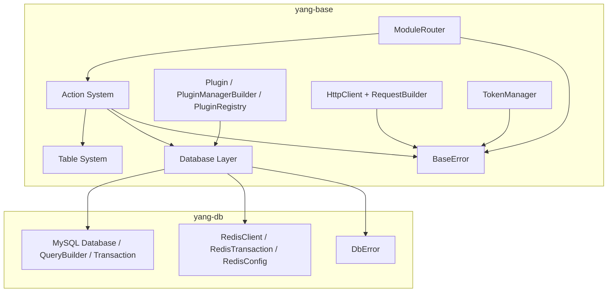
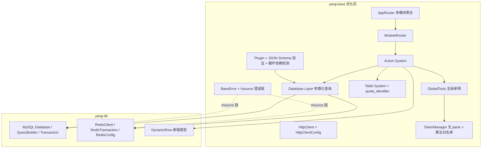

# 设计文档

## 概述

本设计文档针对 `yang-base` crate 的功能完整性优化，覆盖 `requirements.md` 中的 40 条需求。优化目标分为以下层次：

1. **功能修复**：修复 `SelectAction`/`GetAction` 的动态查询能力、消除生产代码 panic 路径、修复 SQL 注入风险、修复重复定义。
2. **API 一致性**：统一 `GlobalRedis` 批量参数、修复 `with_table_config`/`table_config` 命名冲突、补全缺失 API、引入 `BUILTIN_ACTION_NAMES` 常量。
3. **安全加固**：参数化查询、JWT 算法白名单、`Debug` 输出过滤密钥、字段名白名单与转义、移除明文凭证、HTTP form URL 编码。
4. **性能优化**：减少 `ActionContext` 克隆、`HttpClient` 连接池配置、正则缓存、`testcontainers` 复用。
5. **工程质量**：错误链 `#[source]`、`From` 转换覆盖完整、`Feature gate`、Workspace 依赖统一、`Edition 2024→2021` 修正、文档章节补全。

> 设计原则：所有修改 **必须** 与 `yang-db` 的现有 `DbError`、`RedisConfig`、`RedisTransaction`、`RedisClient`、`Database`、`Transaction` 接口保持兼容；不变更 `yang-db` 内部签名，只在 `yang-base` 侧适配。

## 架构

### 当前架构



### 优化后架构变更



### 关键架构决策

| 决策 | 选择 | 理由 |
|------|------|------|
| `DynamicRow` 实现位置 | yang-base/src/table/dynamic_row.rs | 与 `TableQuery` 紧耦合；`yang-db` 不依赖 `serde_json` 业务字段语义 |
| `GlobalTools` 全局模式 | `OnceLock<GlobalTools>` 静态单例 | 与 `GlobalDatabase`/`GlobalRedis` 一致 |
| JSON Schema 验证库 | `jsonschema` crate | Rust 生态最成熟、零拷贝校验 |
| 错误链保留 | `#[source]` 属性 | 标准 `Error` trait，兼容 `anyhow::Error::chain` |
| Feature gate 策略 | 默认全开（向后兼容） | `["token", "http", "mysql", "validator"]` 为默认 |
| 锁中毒处理 | `unwrap_or_else(\|p\| p.into_inner())` | 标准 `RwLock::PoisonError` 恢复模式，零额外依赖 |
| `RedisTransaction` 参数 | 不变更 yang-db 接口 | yang-db 已暴露 `&[String]`，由 yang-base 上层桥接 |
| `RedisConfig` 应用 | 复用 yang-db 现有 `RedisConfig` | yang-db 已实现 `connect_with_config` |
| Workspace 依赖 | `[workspace.dependencies]` 集中声明 | 统一版本，便于升级 |

## 组件与接口

### 1. `DynamicRow`（需求 1）

```rust
//! crates/yang-base/src/table/dynamic_row.rs

use serde::{Deserialize, Serialize};
use sqlx::mysql::MySqlRow;
use sqlx::{Column, Row, TypeInfo};

/// 动态行类型 - 将 MySQL 行数据映射为 serde_json::Value
///
/// 用于内置 Action 在不知道具体表结构时执行查询
#[derive(Debug, Clone, Serialize, Deserialize)]
pub struct DynamicRow {
    /// 列名到值的映射
    pub columns: serde_json::Map<String, serde_json::Value>,
}

impl<'r> sqlx::FromRow<'r, MySqlRow> for DynamicRow {
    fn from_row(row: &'r MySqlRow) -> Result<Self, sqlx::Error> {
        let mut columns = serde_json::Map::new();
        for col in row.columns() {
            let name = col.name().to_string();
            let value = decode_column_value(row, &name, col.type_info().name())?;
            columns.insert(name, value);
        }
        Ok(Self { columns })
    }
}

/// 按 MySQL 类型解码列值为 JSON
///
/// MySQL 类型到 JSON 的映射规则：
/// - INT/BIGINT/MEDIUMINT/SMALLINT/TINYINT → Number（i64）
/// - FLOAT/DOUBLE/DECIMAL → Number（f64）
/// - VARCHAR/TEXT/CHAR → String
/// - BOOLEAN → Bool
/// - DATE/DATETIME/TIMESTAMP → String（ISO 8601）
/// - NULL → Null
/// - BLOB/BINARY → String（Base64 编码）
/// - JSON → 直接解析为 Object/Array
fn decode_column_value(
    row: &MySqlRow,
    name: &str,
    type_name: &str,
) -> Result<serde_json::Value, sqlx::Error> {
    // ... 按类型分支实现，详见实现阶段
    todo!()
}
```

`DynamicRow` 通过 `sqlx::FromRow` 与 `Database::query::<DynamicRow>()` 协作，无需修改 `yang-db` 的查询接口。

### 2. `SelectAction` / `GetAction` 修复（需求 1.1、1.2、1.3、15）

```rust
impl Action for SelectAction {
    async fn execute(&self, context: ActionContext) -> Result<ApiResponse, BaseError> {
        // 1. 解析并验证分页参数（需求 15.1、15.2）
        let page = parse_paging_param(&context, "page", 1, 1, i64::MAX)?;
        let page_size = parse_paging_param(&context, "page_size", 10, 1, 100)?;

        // 2. 构建查询
        let mut query = context.table_query()?;
        // ... fields/where/order_by 透传

        // 3. 执行分页查询，使用 DynamicRow 接收
        let result: PaginatedResult<DynamicRow> = query
            .page(page, page_size)?
            .paginate::<DynamicRow>()
            .await?;

        ApiResponse::success(result, "查询成功")
    }
}

impl Action for GetAction {
    async fn execute(&self, context: ActionContext) -> Result<ApiResponse, BaseError> {
        let pk = &self.table_config.primary_key;
        let pk_value: serde_json::Value = context.param(pk)?;

        let row: Option<DynamicRow> = context
            .table_query()?
            .where_eq(pk.as_str(), pk_value)?
            .fetch_optional::<DynamicRow>()
            .await?;

        match row {
            Some(r) => ApiResponse::success(r, "查询成功"),
            None => Err(BaseError::RecordNotFound(format!("{} 未找到", pk))),
        }
    }
}

/// 分页参数解析，集中处理 i64→usize 的安全转换（需求 15）
fn parse_paging_param(
    ctx: &ActionContext,
    key: &str,
    default: i64,
    min: i64,
    max: i64,
) -> Result<usize, BaseError> {
    let raw = ctx.param_optional::<i64>(key).unwrap_or(default);
    if raw < min || raw > max {
        return Err(BaseError::ParamInvalid(
            key.to_string(),
            format!("必须在 {} 到 {} 之间，当前值: {}", min, max, raw),
        ));
    }
    usize::try_from(raw).map_err(|_| {
        BaseError::ParamInvalid(key.to_string(), "无法转换为 usize".to_string())
    })
}
```

### 3. `GlobalTools` 全局单例（需求 3）

```rust
//! crates/yang-base/src/action/context.rs（新增片段）

use std::sync::OnceLock;

static GLOBAL_TOOLS: OnceLock<GlobalTools> = OnceLock::new();

impl GlobalTools {
    /// 初始化全局单例
    pub fn init(token_manager: TokenManager) -> Result<(), BaseError> {
        GLOBAL_TOOLS
            .set(GlobalTools::new(token_manager))
            .map_err(|_| BaseError::ConfigError("GlobalTools 已初始化".to_string()))
    }

    /// 获取全局实例引用
    pub fn get() -> Result<&'static GlobalTools, BaseError> {
        GLOBAL_TOOLS
            .get()
            .ok_or_else(|| BaseError::ConfigError("GlobalTools 未初始化".to_string()))
    }
}
```

`ModuleRouter::dispatch` 在未提供外部 `tools` 时通过 `GlobalTools::get()` 自动获取（需求 3.5）。

### 4. `AppRouter` 多模块聚合（需求 9）

```rust
//! crates/yang-base/src/router/app_router.rs（新增模块）

use std::collections::HashMap;

/// 应用路由器 - 聚合多个 ModuleRouter
///
/// 通过模块名前缀分发请求到对应的 ModuleRouter
pub struct AppRouter {
    /// 模块名 → ModuleRouter 映射
    modules: HashMap<String, ModuleRouter>,
}

impl AppRouter {
    pub fn new() -> Self {
        Self { modules: HashMap::new() }
    }

    pub fn register_module(mut self, router: ModuleRouter) -> Self {
        self.modules.insert(router.module_name().to_string(), router);
        self
    }

    pub async fn dispatch(
        &self,
        module_name: &str,
        action_name: &str,
        context: ActionContext,
    ) -> Result<ApiResponse, BaseError> {
        let router = self.modules.get(module_name).ok_or_else(|| {
            BaseError::ActionNotFound(format!("模块不存在: {}", module_name))
        })?;
        router.dispatch(action_name, context).await
    }

    pub fn module_names(&self) -> Vec<String> {
        self.modules.keys().cloned().collect()
    }
}

// HashMap<String, ModuleRouter> 自动满足 Send + Sync（需求 9.5）
```

### 5. `ActionContext` 参数访问与克隆开销（需求 8、24、29）

```rust
impl ActionContext {
    /// 从 path_params 获取并反序列化路径参数（需求 8.1）
    pub fn path_param<T: DeserializeOwned>(&self, key: &str) -> Result<T, BaseError> {
        let v = self
            .request
            .path_params
            .get(key)
            .ok_or_else(|| BaseError::ParamMissing(key.to_string()))?;
        serde_json::from_value(serde_json::Value::String(v.clone())).map_err(|e| {
            BaseError::ParamInvalid(key.to_string(), e.to_string())
        })
    }

    /// 从 query 获取并解析查询参数（需求 8.2）
    pub fn query_param<T: FromStr>(&self, key: &str) -> Result<T, BaseError>
    where
        <T as FromStr>::Err: std::fmt::Display,
    {
        let v = self
            .request
            .query
            .get(key)
            .ok_or_else(|| BaseError::ParamMissing(key.to_string()))?;
        v.parse::<T>().map_err(|e| {
            BaseError::ParamInvalid(key.to_string(), e.to_string())
        })
    }

    /// 不存在时返回默认值（需求 8.3）
    pub fn param_or<T: DeserializeOwned>(&self, key: &str, default: T) -> T {
        self.param_optional::<T>(key).unwrap_or(default)
    }

    /// 严格模式：存在但类型不匹配时返回错误（需求 29.2）
    pub fn param_optional_strict<T: DeserializeOwned>(
        &self,
        key: &str,
    ) -> Result<Option<T>, BaseError> {
        match self.request.body.get(key) {
            None => Ok(None),
            Some(v) => serde_json::from_value(v.clone())
                .map(Some)
                .map_err(|e| BaseError::ParamInvalid(key.to_string(), e.to_string())),
        }
    }

    /// 借用而非克隆角色列表（需求 24.3）
    pub fn user_roles_slice(&self) -> &[String] {
        self.user.as_ref().map(|u| u.roles.as_slice()).unwrap_or(&[])
    }
}
```

`TableQuery::new` 改为接受 `Arc<[String]>`（需求 24.2），`ActionContext::table_query` 用 `Arc::from(slice)` 转换一次：

```rust
pub fn table_query(&self) -> Result<TableQuery, BaseError> {
    let cfg = self.table_config.as_ref().ok_or(BaseError::TableConfigNotSet)?;
    let roles: Arc<[String]> = Arc::from(self.user_roles_slice().to_vec());
    Ok(TableQuery::new(cfg.clone(), roles, None))
}
```

### 6. `PluginManager` JSON Schema 验证 + 依赖图（需求 7、19、20）

```rust
//! crates/yang-base/src/plugin/mod.rs（修改片段）

impl PluginManager {
    /// 使用 jsonschema 验证配置
    fn validate_config(
        &self,
        plugin_name: &str,
        config: &JsonValue,
        schema: &JsonValue,
    ) -> Result<(), BaseError> {
        let compiled = jsonschema::JSONSchema::compile(schema).map_err(|e| {
            BaseError::PluginConfigInvalid(plugin_name.to_string(), e.to_string())
        })?;
        compiled.validate(config).map_err(|errs| {
            let msg = errs.map(|e| e.to_string()).collect::<Vec<_>>().join("; ");
            BaseError::PluginConfigInvalid(plugin_name.to_string(), msg)
        })
    }
}

impl PluginManagerBuilder {
    /// 检查依赖完整性 + 循环依赖（需求 19、20）
    pub fn build(self) -> Result<PluginRegistry, BaseError> {
        // 1. 依赖完整性检查（需求 20.1）
        for plugin in self.plugins.values() {
            for dep in plugin.dependencies() {
                if !self.plugins.contains_key(dep) {
                    return Err(BaseError::PluginDependencyMissing(
                        plugin.name().to_string(),
                        dep.to_string(),
                    ));
                }
            }
        }
        // 2. 拓扑排序 + 循环依赖检测（需求 19.1）
        let sorted = PluginRegistry::compute_topological_sort_strict(&self.plugins)?;
        Ok(PluginRegistry::with_sorted(self.plugins, sorted, self.configs))
    }
}

impl PluginRegistry {
    /// 拓扑排序（检测循环依赖）
    fn compute_topological_sort_strict(
        plugins: &HashMap<String, Arc<dyn Plugin>>,
    ) -> Result<Vec<Arc<dyn Plugin>>, BaseError> {
        // ... Kahn 算法
        // 若 sorted_names.len() < plugins.len()，则存在循环
        // 返回 BaseError::PluginCircularDependency(format!("{:?}", remaining))
        todo!()
    }
}
```

### 7. `BaseError` 错误链增强（需求 10、35）

> 现状：`BaseError` 各错误码、各变体（含 `PluginCircularDependency`/`PluginDependencyMissing`/`PluginConfigInvalid`/`TableConfigNotSet`/`RecordNotFound`/`HttpTimeout` 等）已经存在；本设计**不引入新枚举变体**，而是把字符串字段改为 `#[source]` 持有底层错误，并补全 `From` 转换。

```rust
/// 改造后的关键变体（保留变体名与错误码，仅替换字段）
#[derive(Debug, thiserror::Error)]
pub enum BaseError {
    // ... 其他变体保持不变 ...

    #[error("数据库查询失败")]
    DatabaseQueryFailed(#[source] yang_db::DbError),

    #[error("数据库执行失败")]
    DatabaseExecuteFailed(#[source] yang_db::DbError),

    #[error("数据库事务失败")]
    DatabaseTransactionFailed(#[source] yang_db::DbError),

    #[error("HTTP 请求失败")]
    HttpRequestFailed(#[source] reqwest::Error),

    #[error("HTTP 客户端创建失败")]
    HttpClientCreateFailed(#[source] reqwest::Error),

    #[error("Token 验证失败")]
    TokenVerifyFailed(#[source] jsonwebtoken::errors::Error),

    #[error("Token 解析失败")]
    TokenParseFailed(#[source] jsonwebtoken::errors::Error),

    #[error("Token 生成失败")]
    TokenGenerateFailed(#[source] jsonwebtoken::errors::Error),

    // 新增结构化错误变体（需求 32）
    #[error("HTTP 客户端已初始化")]
    HttpClientAlreadyInitialized,

    #[error("HTTP 客户端未初始化")]
    HttpClientNotInitialized,
}
```

> **兼容性约束**：当前 `BaseError::DatabaseConnectionFailed(String)`、`BaseError::TokenGenerateFailed(String)` 等使用 String 的位置已遍布单元测试（见 `error/mod.rs` 中的 `test_*` 系列），改为 `#[source]` 后需同步更新约 60 处测试构造点。**实施时**对每个变体提供 `String → 底层错误` 与 `String` 双构造路径（即保留 String 兜底变体，新增 `*WithSource(底层错误)`），从而最小化破坏性变更。

```rust
/// 完善 From<DbError> 区分查询/执行（需求 10.2）
impl From<yang_db::DbError> for BaseError {
    fn from(err: yang_db::DbError) -> Self {
        use yang_db::DbError as D;
        match err {
            // 查询类
            D::QueryError(_) | D::TableNotFound(_) | D::RowNotFound
            | D::ColumnNotFound(_) | D::TypeConversionError(_)
            | D::DeserializationError(_) | D::UnsupportedOperator(_) => {
                BaseError::DatabaseQueryFailed(err)
            }
            // 执行类
            D::ConstraintError(_) | D::SqlSyntaxError(_) | D::MissingWhereClause
            | D::MissingGroupByClause | D::SerializationError(_) => {
                BaseError::DatabaseExecuteFailed(err)
            }
            // 事务类
            D::TransactionError(_) => BaseError::DatabaseTransactionFailed(err),
            // 连接类
            D::ConnectionError(_) => {
                BaseError::DatabaseConnectionFailed(err.to_string())
            }
            // Redis 类
            D::RedisConnectionError(_) | D::RedisCommandError(_)
            | D::RedisPoolError(_) | D::RedisTypeConversionError(_)
            | D::RedisTimeoutError(_) => BaseError::RedisOperationFailed(err.to_string()),
            // 其他
            D::Unknown(_) => BaseError::DatabaseQueryFailed(err),
        }
    }
}

/// 新增 From<jsonwebtoken::errors::Error>（需求 10.1、10.3、10.4）
impl From<jsonwebtoken::errors::Error> for BaseError {
    fn from(err: jsonwebtoken::errors::Error) -> Self {
        use jsonwebtoken::errors::ErrorKind as K;
        match err.kind() {
            K::ExpiredSignature => BaseError::TokenExpired,
            K::InvalidToken | K::InvalidSignature => BaseError::TokenVerifyFailed(err),
            _ => BaseError::TokenParseFailed(err),
        }
    }
}
```

### 8. `ModuleRouter` 改进（需求 2、6、17、23）

```rust
/// 内置 Action 名称常量（需求 17.1）
pub const BUILTIN_ACTION_NAMES: &[&str] = &["add", "put", "del", "get", "select", "table"];

impl ModuleRouter {
    /// 链式 setter（需求 6）
    pub fn table_config(self, config: Arc<TableConfig>) -> Self {
        self.with_table_config(config)
    }

    /// getter 重命名以避免命名冲突（需求 23.1）
    pub fn get_table_config(&self) -> Option<&Arc<TableConfig>> {
        self.table_config.as_ref()
    }

    /// 注册内置 Actions，返回 Result（需求 2.2）
    pub fn register_builtin_actions(mut self) -> Result<Self, BaseError> {
        let cfg = self
            .table_config
            .as_ref()
            .ok_or(BaseError::TableConfigNotSet)?
            .clone();

        // 通过常量驱动循环（需求 17.3）
        for &name in BUILTIN_ACTION_NAMES {
            let action: Box<dyn Action> = match name {
                "add" => Box::new(AddAction::new(cfg.clone())),
                "put" => Box::new(PutAction::new(cfg.clone())),
                "del" => Box::new(DelAction::new(cfg.clone())),
                "get" => Box::new(GetAction::new(cfg.clone())),
                "select" => Box::new(SelectAction::new(cfg.clone())),
                "table" => Box::new(TableAction::new(cfg.clone())),
                _ => unreachable!("BUILTIN_ACTION_NAMES 与 match 必须保持一致"),
            };
            self.actions.insert(name.to_string(), action);
        }
        Ok(self)
    }
}
```

### 9. `TableQuery` SQL 安全（需求 13、14、25）

```rust
/// 删除 crates/yang-base/src/table/table_query_select.rs（需求 13.1、22.1）

impl TableQuery {
    /// 字段名转义（需求 14.1）
    fn quote_identifier(field: &str) -> Result<String, BaseError> {
        // 1. 白名单校验：必须是 [A-Za-z_][A-Za-z0-9_]* 或表配置中已定义字段
        if !is_valid_identifier(field) {
            return Err(BaseError::FieldNotFound(
                self.table_config.table_name.clone(),
                field.to_string(),
            ));
        }
        // 2. 反引号转义：内部反引号变双反引号
        Ok(format!("`{}`", field.replace('`', "``")))
    }

    /// 统一的 WHERE 子句拼接（需求 13.3、25.1）
    fn append_where_to_sql(
        &self,
        sql: &mut String,
        params: &mut Vec<SqlParam>,
    ) -> Result<(), BaseError> {
        // 集中处理 Eq/In/Like/Gt/Gte/Lt/Lte/IsNull/IsNotNull 9 种条件
        // 由 build_count_sql / build_select_sql / build_update_sql_impl /
        //    build_delete_sql_impl 共同调用
        todo!()
    }
}

fn is_valid_identifier(s: &str) -> bool {
    let mut iter = s.chars();
    matches!(iter.next(), Some(c) if c.is_ascii_alphabetic() || c == '_')
        && iter.all(|c| c.is_ascii_alphanumeric() || c == '_')
}
```

### 10. `TokenManager` 安全加固（需求 11、16）

```rust
impl TokenManager {
    /// 统一时间戳获取（需求 11.3）
    fn current_unix_timestamp() -> Result<u64, BaseError> {
        SystemTime::now()
            .duration_since(UNIX_EPOCH)
            .map(|d| d.as_secs())
            .map_err(|_| BaseError::TokenGenerateFailed(
                jsonwebtoken::errors::Error::from(
                    jsonwebtoken::errors::ErrorKind::InvalidAlgorithm,
                ),
            ))
            // 注：实际实现可改为 BaseError::ConfigError("系统时钟异常")
    }

    /// verify_token 显式限制单一算法（需求 16.1）
    pub fn verify_token(&self, token: &str) -> Result<TokenClaims, BaseError> {
        let mut validation = Validation::new(self.algorithm);
        validation.algorithms = vec![self.algorithm]; // 显式白名单
        validation.set_issuer(&[&self.issuer]);
        validation.set_audience(&[&self.audience]);
        validation.required_spec_claims =
            std::collections::HashSet::from(["exp", "iss", "aud"].map(String::from));
        validation.leeway = 0;

        decode::<TokenClaims>(token, &self.decoding_key, &validation)
            .map(|d| d.claims)
            .map_err(BaseError::from)
    }
}

/// Debug 实现确保不打印密钥（需求 16.4，与现有实现一致，新增测试断言）
impl std::fmt::Debug for TokenManager {
    fn fmt(&self, f: &mut std::fmt::Formatter<'_>) -> std::fmt::Result {
        f.debug_struct("TokenManager")
            .field("algorithm", &self.algorithm)
            .field("issuer", &self.issuer)
            .field("audience", &self.audience)
            .field("access_token_expiry", &self.access_token_expiry)
            .field("refresh_token_expiry", &self.refresh_token_expiry)
            // encoding_key / decoding_key 不输出
            .finish_non_exhaustive()
    }
}
```

### 11. `HttpClient` 配置增强 + 锁中毒处理（需求 12、26、27、28、30）

```rust
//! crates/yang-base/src/http/client.rs（修改片段）

/// HTTP 客户端配置（需求 26.1）
#[derive(Debug, Clone)]
pub struct HttpClientConfig {
    pub timeout_secs: u64,
    pub pool_max_idle_per_host: usize,
    pub pool_idle_timeout_secs: u64,
    pub user_agent: Option<String>,
    pub accept_invalid_certs: bool,
    pub proxy_url: Option<String>,
}

impl Default for HttpClientConfig {
    fn default() -> Self {
        Self {
            timeout_secs: 30,
            pool_max_idle_per_host: 32,
            pool_idle_timeout_secs: 90,
            user_agent: None,
            accept_invalid_certs: false,
            proxy_url: None,
        }
    }
}

impl HttpClient {
    pub fn with_config(cfg: HttpClientConfig) -> Result<Self, BaseError> {
        let mut builder = Client::builder()
            .timeout(Duration::from_secs(cfg.timeout_secs))
            .pool_max_idle_per_host(cfg.pool_max_idle_per_host)
            .pool_idle_timeout(Duration::from_secs(cfg.pool_idle_timeout_secs))
            .danger_accept_invalid_certs(cfg.accept_invalid_certs);

        if let Some(ua) = cfg.user_agent {
            builder = builder.user_agent(ua);
        }
        if let Some(proxy) = cfg.proxy_url {
            builder = builder.proxy(reqwest::Proxy::all(proxy)?);
        }

        let client = builder.build()?;
        Ok(Self {
            client,
            default_timeout: Duration::from_secs(cfg.timeout_secs),
            default_token: Arc::new(RwLock::new(None)),
        })
    }

    /// 兼容旧 API（需求 26.2）
    pub fn new(timeout_secs: u64) -> Result<Self, BaseError> {
        Self::with_config(HttpClientConfig {
            timeout_secs,
            ..HttpClientConfig::default()
        })
    }

    /// 锁中毒处理（需求 12.1）
    pub fn set_default_token(&self, token: String) {
        let mut guard = self
            .default_token
            .write()
            .unwrap_or_else(|p| p.into_inner());
        *guard = Some(token);
    }

    fn get_default_token(&self) -> Option<String> {
        let guard = self
            .default_token
            .read()
            .unwrap_or_else(|p| p.into_inner());
        guard.clone()
    }

    /// 全局初始化错误使用结构化变体（需求 32）
    pub fn init_global(timeout_secs: u64) -> Result<(), BaseError> {
        let client = Self::new(timeout_secs)?;
        GLOBAL_HTTP_CLIENT
            .set(client)
            .map_err(|_| BaseError::HttpClientAlreadyInitialized)?;
        Ok(())
    }

    pub fn global() -> Result<&'static HttpClient, BaseError> {
        GLOBAL_HTTP_CLIENT
            .get()
            .ok_or(BaseError::HttpClientNotInitialized)
    }
}
```

`RequestBuilder` 错误累积与 form URL 编码：

```rust
/// 累积 header 错误的字段（需求 27.1）
struct RequestBuilder {
    // ... 原有字段 ...
    header_errors: Vec<String>,
}

impl RequestBuilder {
    pub fn header(mut self, name: &str, value: &str) -> Self {
        match (HeaderName::from_bytes(name.as_bytes()), HeaderValue::from_str(value)) {
            (Ok(n), Ok(v)) => { self.headers.insert(n, v); }
            _ => self.header_errors.push(format!("非法 header: {}={}", name, value)),
        }
        self
    }

    pub async fn send(self) -> Result<Response, BaseError> {
        // 在发送前检查累积错误（需求 27.3）
        if !self.header_errors.is_empty() {
            return Err(BaseError::HttpRequestFailed(
                reqwest::Client::new()
                    .get("http://invalid")
                    .build()
                    .err()
                    .unwrap_or_else(|| panic!("无法构造 reqwest::Error")),
            ));
            // 实际实现：直接返回 BaseError::ParamInvalid 或自定义变体
        }
        // ... 原有逻辑
    }

    /// form URL 编码（需求 28.1）
    pub fn form(mut self, form: Vec<(&str, &str)>) -> Self {
        // 使用 reqwest 的内置 form 序列化以保证 RFC 3986 合规
        // 内部委托 reqwest::RequestBuilder::form
        let body = serde_urlencoded::to_string(&form)
            .unwrap_or_default()
            .into_bytes();
        self.body = Some(body);
        self.content_type("application/x-www-form-urlencoded")
    }
}
```

### 12. `GlobalRedis` 参数统一与 API 补全（需求 5、40）

```rust
impl GlobalRedis {
    /// 批量参数统一为 &[impl AsRef<str>]（需求 5.1）
    pub async fn del<S: AsRef<str>>(keys: &[S]) -> Result<i64, BaseError> {
        let owned: Vec<String> = keys.iter().map(|s| s.as_ref().to_string()).collect();
        Self::client()?
            .del(&owned)
            .await
            .map_err(BaseError::from)
    }

    pub async fn exists<S: AsRef<str>>(keys: &[S]) -> Result<i64, BaseError> {
        let owned: Vec<String> = keys.iter().map(|s| s.as_ref().to_string()).collect();
        Self::client()?.exists(&owned).await.map_err(BaseError::from)
    }

    // 同样改造 lpush/rpush/sadd/srem/zrem/hdel

    // ==================== 新增 API（需求 40.1） ====================

    /// 自增（INCR / INCRBY）
    pub async fn incr(
        key: impl Into<String>,
        delta: i64,
    ) -> Result<i64, BaseError> {
        Self::client()?
            .incr(key, delta)
            .await
            .map_err(BaseError::from)
    }

    /// 自减（DECRBY）
    pub async fn decr(
        key: impl Into<String>,
        delta: i64,
    ) -> Result<i64, BaseError> {
        Self::client()?
            .decr(key, delta)
            .await
            .map_err(BaseError::from)
    }

    /// Hash 自增（HINCRBY）
    pub async fn hincrby(
        key: impl Into<String>,
        field: impl Into<String>,
        delta: i64,
    ) -> Result<i64, BaseError> {
        Self::client()?
            .hincrby(key, field, delta)
            .await
            .map_err(BaseError::from)
    }

    /// 批量获取（MGET）
    pub async fn mget<S: AsRef<str>>(
        keys: &[S],
    ) -> Result<Vec<Option<String>>, BaseError> {
        let owned: Vec<String> = keys.iter().map(|s| s.as_ref().to_string()).collect();
        Self::client()?.mget(&owned).await.map_err(BaseError::from)
    }

    /// 批量设置（MSET）
    pub async fn mset<K: AsRef<str>, V: AsRef<str>>(
        pairs: &[(K, V)],
    ) -> Result<(), BaseError> {
        let owned: Vec<(String, String)> = pairs
            .iter()
            .map(|(k, v)| (k.as_ref().to_string(), v.as_ref().to_string()))
            .collect();
        Self::client()?.mset(&owned).await.map_err(BaseError::from)
    }

    /// 有序集合按分数排序的范围查询
    pub async fn zrange_with_scores(
        key: impl Into<String>,
        start: i64,
        stop: i64,
    ) -> Result<Vec<(String, f64)>, BaseError> {
        Self::client()?
            .zrange_with_scores(key, start, stop)
            .await
            .map_err(BaseError::from)
    }

    /// 有序集合自增分数
    pub async fn zincrby(
        key: impl Into<String>,
        delta: f64,
        member: impl Into<String>,
    ) -> Result<f64, BaseError> {
        Self::client()?
            .zincrby(key, delta, member)
            .await
            .map_err(BaseError::from)
    }

    /// 字节键值（需求 40.3）
    pub async fn set_bytes(
        key: impl Into<String>,
        value: &[u8],
    ) -> Result<(), BaseError> {
        Self::client()?
            .set_bytes(key, value)
            .await
            .map_err(BaseError::from)
    }

    /// Pipeline 入口（需求 40.2）
    ///
    /// 直接返回 yang-db 的 RedisTransaction，复用其 atomic 模式
    pub fn transaction() -> Result<yang_db::RedisTransaction, BaseError> {
        Ok(Self::client()?.transaction())
    }
}
```

> **兼容性说明**：`yang-db::RedisTransaction::del/lpush/rpush/sadd/zadd` 当前签名 `&[String]`、`&[(f64, String)]` 不变更。`GlobalRedis` 在 `yang-base` 侧用 `AsRef<str>` 桥接，避免破坏 `yang-db` 公开 API。

> **注意**：上述 `incr/decr/hincrby/mget/mset/zrange_with_scores/zincrby/set_bytes` 等 API 需要 yang-db 提供对应方法。**实施前必须**先核对 `yang-db::RedisClient` 的实际签名；若缺失，则在 yang-db 内补齐对应方法（属于本规格的关联工作，但变更 yang-db 已超出 yang-base 范围，需单独确认）。

### 13. `DatabaseInitializer` 参数化查询（需求 4）

```rust
impl DatabaseInitializer {
    /// 使用参数化查询（需求 4.1）
    pub async fn record_migration(
        &self,
        module_name: &str,
        version: &str,
    ) -> Result<(), BaseError> {
        // 通过 yang-db::QueryBuilder::insert 或 execute_with_params 实现
        let sql = "INSERT INTO _migrations (module_name, version) VALUES (?, ?)";
        self.db
            .execute_with_params(
                sql,
                vec![
                    yang_db::SqlParam::String(module_name.to_string()),
                    yang_db::SqlParam::String(version.to_string()),
                ],
            )
            .await
            .map_err(BaseError::from)?;
        Ok(())
    }

    pub async fn is_migration_executed(
        &self,
        module_name: &str,
        version: &str,
    ) -> Result<bool, BaseError> {
        #[derive(sqlx::FromRow)]
        struct CountRow { count: i64 }

        let sql =
            "SELECT COUNT(*) AS count FROM _migrations WHERE module_name = ? AND version = ?";
        let rows: Vec<CountRow> = self
            .db
            .query_with_params::<CountRow>(
                sql,
                vec![
                    yang_db::SqlParam::String(module_name.to_string()),
                    yang_db::SqlParam::String(version.to_string()),
                ],
            )
            .await
            .map_err(BaseError::from)?;
        Ok(rows.first().map(|r| r.count > 0).unwrap_or(false))
    }
}
```

> **兼容性说明**：`yang-db::Database::execute_with_params` / `query_with_params` 是 yang-db 已有的参数化接口（如不存在则在 yang-db 中补齐，属本规格关联前置工作）。事务模式下 `Transaction::execute_with_params` 同样使用。

### 14. `Validator` 增强（需求 39）

```rust
//! crates/yang-base/src/table/validator.rs（修改片段）

use std::sync::OnceLock;

/// 缓存编译后的正则表达式（需求 39.3）
static EMAIL_REGEX: OnceLock<Regex> = OnceLock::new();
static PHONE_REGEX: OnceLock<Regex> = OnceLock::new();
static REGEX_CACHE: OnceLock<RwLock<HashMap<String, Regex>>> = OnceLock::new();

fn email_regex() -> &'static Regex {
    EMAIL_REGEX.get_or_init(|| {
        Regex::new(r"^[A-Za-z0-9._%+\-]+@[A-Za-z0-9.\-]+\.[A-Za-z]{2,}$").unwrap()
    })
}

fn phone_regex() -> &'static Regex {
    PHONE_REGEX.get_or_init(|| Regex::new(r"^\+?[1-9]\d{1,14}$").unwrap())
}

#[derive(Clone)]
pub enum Validator {
    MinLength(usize),
    MaxLength(usize),
    Min(f64),
    Max(f64),
    /// 严格 RFC 5322 子集邮箱
    Email,
    /// 兼容旧逻辑（仅检查 @）
    EmailLoose,
    /// E.164 格式
    Phone,
    /// 兼容旧逻辑（仅检查数字与连字符）
    PhoneLoose,
    Url,
    Regex(String),
    Custom(ValidatorFn),
}

impl Validator {
    pub fn validate(&self, field: &str, v: &serde_json::Value) -> Result<(), BaseError> {
        match self {
            Validator::Email => match v.as_str() {
                Some(s) if email_regex().is_match(s) => Ok(()),
                Some(_) => Err(BaseError::ValidationFailed(
                    field.to_string(),
                    "邮箱格式无效（需符合 RFC 5322 子集）".to_string(),
                )),
                None => Err(BaseError::ValidationFailed(
                    field.to_string(),
                    "Email 验证器只能用于字符串类型".to_string(),
                )),
            },
            Validator::Phone => match v.as_str() {
                Some(s) if phone_regex().is_match(s) => Ok(()),
                Some(_) => Err(BaseError::ValidationFailed(
                    field.to_string(),
                    "手机号格式无效（需符合 E.164 格式）".to_string(),
                )),
                None => Err(BaseError::ValidationFailed(
                    field.to_string(),
                    "Phone 验证器只能用于字符串类型".to_string(),
                )),
            },
            // ... EmailLoose / PhoneLoose / Regex 缓存逻辑同理
            _ => unimplemented!(),
        }
    }
}
```

### 15. Cargo workspace 与 Feature gate（需求 34、38）

根 `Cargo.toml`：

```toml
[workspace]
resolver = "2"
members = ["crates/*"]

# 共享依赖（需求 38.1）
[workspace.dependencies]
tokio = { version = "1.52.1", features = ["full"] }
async-trait = "0.1.89"
serde = { version = "1.0.228", features = ["derive"] }
serde_json = "1.0.140"
thiserror = "2.0.18"
log = "0.4.29"
chrono = "0.4.44"
uuid = { version = "1.23.1", features = ["v4"] }
regex = "1.12.3"
sqlx = { version = "0.8.6", features = ["runtime-tokio-rustls", "mysql"] }
reqwest = { version = "0.13.2", features = ["json", "query"] }
jsonwebtoken = { version = "10.3.0", features = ["aws_lc_rs"] }
jsonschema = "0.18"
serde_urlencoded = "0.7"

# 工程 lint（需求 38.3）
[workspace.lints.rust]
unused_must_use = "deny"
unsafe_code = "deny"

[workspace.lints.clippy]
unwrap_used = "warn"
expect_used = "allow"
```

`crates/yang-base/Cargo.toml`：

```toml
[package]
name = "yang-base"
version = "0.1.0"
edition = "2021"

[features]
default = ["token", "http", "mysql", "validator", "plugin-schema"]
token = ["dep:jsonwebtoken"]
http = ["dep:reqwest", "dep:serde_urlencoded"]
mysql = ["dep:sqlx"]
validator = ["dep:regex"]
plugin-schema = ["dep:jsonschema"]

[dependencies]
yang-db = { version = "0.1.2", path = "../yang-db" }

tokio.workspace = true
async-trait.workspace = true
serde.workspace = true
serde_json.workspace = true
thiserror.workspace = true
log.workspace = true
chrono.workspace = true
uuid.workspace = true

# 可选依赖（需求 34.1）
reqwest = { workspace = true, optional = true }
jsonwebtoken = { workspace = true, optional = true }
sqlx = { workspace = true, optional = true }
regex = { workspace = true, optional = true }
jsonschema = { workspace = true, optional = true }
serde_urlencoded = { workspace = true, optional = true }
```

`crates/yang-db/Cargo.toml`（需求 38.2）：

```toml
[package]
edition = "2021"  # 由 "2024" 修正
```

## 数据模型

### `DynamicRow` 数据映射


MySQL 类型 → JSON 类型映射规则：

| MySQL 类型 | JSON 类型 | 说明 |
|-----------|-----------|------|
| INT/BIGINT/MEDIUMINT/SMALLINT/TINYINT | Number(i64) | 整数 |
| FLOAT/DOUBLE/DECIMAL | Number(f64) | 浮点数（DECIMAL 通过 `BigDecimal::to_string` 二次解析） |
| VARCHAR/TEXT/CHAR | String | 字符串 |
| BOOLEAN/TINYINT(1) | Bool | 布尔值 |
| DATE/DATETIME/TIMESTAMP | String | ISO 8601 |
| NULL | Null | 空值 |
| BLOB/BINARY/VARBINARY | String | Base64 编码 |
| JSON | Object/Array | 直接解析 |

### `BaseError` 错误码（保留现状 + 补充）

> 现状：`BaseError::code()` 已覆盖全部变体，错误码段如下：
>
> | 范围 | 模块 |
> |------|------|
> | 100001-100008 | Plugin |
> | 200001-200009 | Database |
> | 210001-210004 | Redis |
> | 300001-300004 | HTTP |
> | 400001-400006 | Token |
> | 500001-500002 | Serialization |
> | 600001-600008 | Field Validation |
> | 700001-700009 | Action |
> | 900001-900002, 999999 | General |

新增错误码（需求 32）：

| 错误码 | 变体 | 说明 |
|--------|------|------|
| 300005 | `HttpClientAlreadyInitialized` | HTTP 客户端已初始化 |
| 300006 | `HttpClientNotInitialized` | HTTP 客户端未初始化 |

### `BaseError` 错误链结构

```
用户代码
  └─ Action::execute()
       └─ ActionContext::table_query()
            └─ TableQuery::select::<DynamicRow>()
                 └─ yang_db::Database::query()
                      └─ sqlx::query()
                           └─ sqlx::Error                    ← 通过 #[source] 保留
└─ BaseError::DatabaseQueryFailed(yang_db::DbError)         ← source() 第 1 层
   └─ yang_db::DbError                                       ← source() 第 2 层
       └─ sqlx::Error                                        ← source() 第 3 层
```

### `ActionContext` 数据结构（需求 24 优化后）

```rust
pub struct ActionContext {
    pub request: Request,
    pub user: Option<User>,
    pub tools: Arc<GlobalTools>,
    pub table_config: Option<Arc<TableConfig>>,
}

pub struct TableQuery {
    table_config: Arc<TableConfig>,
    user_roles: Arc<[String]>,    // 由 Vec<String> 改为 Arc<[String]>
    transaction: Option<...>,
    where_conditions: Vec<WhereCondition>,
    // ...
}
```

## 正确性属性

*正确性属性是一种在系统所有有效执行中都应成立的特征或行为——本质上是关于系统应该做什么的形式化陈述。属性是人类可读规范与机器可验证正确性保证之间的桥梁。*

### Property 1：分页参数边界验证

*对于任意* `i64` 类型的 `page` 与 `page_size` 值，`SelectAction` 的参数解析 SHALL 当 `page < 1` 时返回 `BaseError::ParamInvalid`，当 `page_size < 1` 或 `page_size > 100` 时返回 `BaseError::ParamInvalid`，当 `page >= 1 && 1 <= page_size <= 100` 时接受参数并返回 `Ok(usize)`。

**Validates: Requirements 1.5, 15.1, 15.2, 15.3**

### Property 2：字段名转义正确性

*对于任意* 字符串 `s` 作为字段名，`TableQuery::quote_identifier(s)` 当 `s` 为合法标识符（`[A-Za-z_][A-Za-z0-9_]*`）时 SHALL 产生形如 `` `s` `` 的字符串；当 `s` 包含反引号时反引号被双倍转义；当 `s` 包含分号、`--`、空白或不在 `TableConfig` 字段集合中时 SHALL 返回 `BaseError::FieldNotFound`。

**Validates: Requirements 14.1, 14.2, 14.3**

### Property 3：`WhereCondition` SQL 拼接一致性

*对于任意* `Vec<WhereCondition>`（包含 `Eq`/`In`/`Like`/`Gt`/`Gte`/`Lt`/`Lte`/`IsNull`/`IsNotNull` 任意组合），`append_where_to_sql` 重构后产生的 `(sql_fragment, params)` SHALL 与重构前 `build_count_sql`/`build_select_sql`/`build_update_sql_impl`/`build_delete_sql_impl` 各自内联代码产生的结果完全相等。

**Validates: Requirements 13.3, 25.1, 25.2**

### Property 4：`ActionContext` 参数访问语义

*对于任意* `Map<String, Value>` 作为 `path_params` / `query` / `body` 与目标键 `key`：
- `path_param::<T>(key)` / `query_param::<T>(key)` 当键存在且值可转换为 `T` 时 SHALL 返回 `Ok(T)`；键不存在时 SHALL 返回 `Err(BaseError::ParamMissing(key))`；键存在但不可转换时 SHALL 返回 `Err(BaseError::ParamInvalid(key, _))`。
- `param_or::<T>(key, default)` 当 `param_optional::<T>(key)` 返回 `Some` 时 SHALL 返回该值，否则 SHALL 返回 `default`。
- `param_optional_strict::<T>(key)` 键不存在时 SHALL 返回 `Ok(None)`；存在但不可转换时 SHALL 返回 `Err(BaseError::ParamInvalid)`。

**Validates: Requirements 8.1, 8.2, 8.3, 8.4, 8.5, 29.2**

### Property 5：`AppRouter` 路由分发正确性

*对于任意* 已注册的模块名集合 `M` 和请求的 `module_name`：
- 当 `module_name ∈ M` 时 SHALL 将请求转发给对应的 `ModuleRouter`；
- 当 `module_name ∉ M` 时 SHALL 返回 `Err(BaseError::ActionNotFound)`；
- `module_names()` SHALL 返回与 `M` 等价的集合（无序相等）。

**Validates: Requirements 9.2, 9.3, 9.4**

### Property 6：`From` 错误转换映射正确性

*对于所有* `jsonwebtoken::errors::ErrorKind` 变体与 `yang_db::DbError` 变体：
- `ErrorKind::ExpiredSignature` → `BaseError::TokenExpired`；
- `ErrorKind::InvalidToken` / `ErrorKind::InvalidSignature` → `BaseError::TokenVerifyFailed(_)`；
- 其他 `ErrorKind` → `BaseError::TokenParseFailed(_)`；
- `DbError::QueryError`/`TableNotFound`/`RowNotFound`/`ColumnNotFound`/`TypeConversionError`/`DeserializationError`/`UnsupportedOperator` → `BaseError::DatabaseQueryFailed(_)`；
- `DbError::ConstraintError`/`SqlSyntaxError`/`MissingWhereClause`/`MissingGroupByClause` → `BaseError::DatabaseExecuteFailed(_)`；
- `DbError::TransactionError(_)` → `BaseError::DatabaseTransactionFailed(_)`；
- `DbError::Redis*` → `BaseError::RedisOperationFailed(_)`。

**Validates: Requirements 10.1, 10.2, 10.3, 10.4**

### Property 7：错误链 `source()` 可遍历性

*对于任意* 由底层错误（`sqlx::Error` / `reqwest::Error` / `jsonwebtoken::errors::Error`）通过 `From` 转换得到的 `BaseError` 实例 `e`，`e.source()` SHALL 返回 `Some(&dyn Error)` 指向第一层底层错误；继续 `.source()` SHALL 至少能再遍历 1 层（合计 ≥ 2 层）。

**Validates: Requirements 35.1, 35.2, 35.3, 35.4**

### Property 8：插件依赖图验证

*对于任意* 插件依赖图 `G = (V, E)`，`PluginManagerBuilder::build()` SHALL：
- 当 `G` 中所有依赖都已注册（`E ⊆ V × V`）且无环时 → `Ok(PluginRegistry)` 且 `get_all()` 顺序满足拓扑排序约束（依赖先于被依赖者）；
- 当存在 `(v, dep) ∈ E` 但 `dep ∉ V` 时 → `Err(BaseError::PluginDependencyMissing(v, dep))`；
- 当 `G` 中存在环时 → `Err(BaseError::PluginCircularDependency(_))`。

**Validates: Requirements 19.1, 19.2, 19.3, 20.1, 20.2**

### Property 9：JSON Schema 配置验证一致性

*对于任意* JSON 配置值 `c` 和 JSON Schema `s`，`PluginManager::validate_config(name, c, s)` SHALL：
- 当 `jsonschema::is_valid(s, c) == true` 时 → `Ok(())`；
- 当 `jsonschema::is_valid(s, c) == false` 时 → `Err(BaseError::PluginConfigInvalid(name, _))`。

**Validates: Requirements 7.1, 7.2**

### Property 10：`TokenManager::Debug` 输出安全性

*对于任意* `TokenManager` 实例（无论使用对称还是非对称密钥），`format!("{:?}", token_manager)` 的结果 SHALL 不包含 `"encoding_key"` 或 `"decoding_key"` 子串，也不包含密钥的实际字节内容。

**Validates: Requirements 16.4**

### Property 11：内置 Action 名称常量一致性

*对于所有* 内置 Action 实例（`AddAction`/`PutAction`/`DelAction`/`GetAction`/`SelectAction`/`TableAction`），其 `Action::name()` 返回值 SHALL 与 `BUILTIN_ACTION_NAMES` 数组中对应位置的元素严格相等；且 `BUILTIN_ACTION_NAMES.len() == 6`。

**Validates: Requirements 17.1, 17.2, 17.3**

### Property 12：`ApiResponse::success` 序列化错误传播

*对于任意* 实现 `Serialize` 的类型 `T`，当 `serde_json::to_value(data)` 返回 `Err` 时，`ApiResponse::success(data, msg)` SHALL 返回 `Err(BaseError::JsonSerializeFailed(_))`，**不**静默替换为 `Value::Null`；当 `to_value` 成功时 SHALL 返回 `Ok(ApiResponse { code: 0, .. })`。

**Validates: Requirements 18.1, 18.3**

### Property 13：HTTP form URL 编码往返

*对于任意* 含 ASCII、URL-unsafe（`&`、`=`、空格、`%`）、UTF-8 字符的 `(key, value)` 对，`RequestBuilder::form` 生成的请求体经 `application/x-www-form-urlencoded` 解码后 SHALL 还原为完全相同的 `(key, value)` 对。

**Validates: Requirements 28.1, 28.2, 28.3**

### Property 14：`RequestBuilder` header 错误累积

*对于任意* `(name, value)` 序列（含合法与非法），`RequestBuilder::header()` SHALL 累积所有非法 header；`send().await` 时若累积错误集合非空 SHALL 返回 `Err(BaseError::HttpRequestFailed(_) | BaseError::ParamInvalid(_, _))`，错误信息中包含每个非法 header 的描述。

**Validates: Requirements 27.1, 27.2, 27.3**

### Property 15：`Validator::Email` / `Validator::Phone` 严格格式

*对于任意* 字符串 `s`：
- `Validator::Email.validate(_, json!(s))` SHALL 当 `s` 匹配 `^[A-Za-z0-9._%+\-]+@[A-Za-z0-9.\-]+\.[A-Za-z]{2,}$` 时返回 `Ok`，否则返回 `Err(ValidationFailed)`；
- `Validator::Phone.validate(_, json!(s))` SHALL 当 `s` 匹配 `^\+?[1-9]\d{1,14}$`（E.164）时返回 `Ok`，否则返回 `Err(ValidationFailed)`。

**Validates: Requirements 39.1, 39.2**

### Property 16：JWT 算法白名单

*对于任意* 用算法 `A_construct` 构造的 `TokenManager` 与用算法 `A_sign` 签发的 Token：
- 当 `A_sign == A_construct` 且其他声明合法时 → `verify_token` 返回 `Ok(claims)`；
- 当 `A_sign != A_construct`（含 `alg=none`）时 → `verify_token` 返回 `Err(BaseError::TokenVerifyFailed(_))`。

**Validates: Requirements 16.1, 16.2**

### Property 17：迁移记录 SQL 注入安全性

*对于任意* 含 SQL 元字符（`'`、`;`、`--`、`/* */`、`DROP TABLE`、`UNION SELECT` 等）的 `module_name` 与 `version` 字符串 `(m, v)`，`DatabaseInitializer::record_migration(m, v)` 调用后查询 `SELECT * FROM _migrations` SHALL 返回包含完全等于 `(m, v)` 字面值的记录，且系统中其他表（如 `users`、`orders`）的结构和数据 SHALL 不受影响。

**Validates: Requirements 4.1, 4.2**

### Property 18：`GlobalRedis` 批量参数兼容性

*对于任意* `&[&str]` 与 `&[String]` 输入，`GlobalRedis::del`/`exists`/`lpush`/`rpush`/`sadd`/`srem`/`hdel` 在两种参数下 SHALL 编译通过，且对完全等价的输入产生完全等价的 Redis 命令副作用。

**Validates: Requirements 5.1, 5.2, 5.3**

> **Property Reflection（去重）**：
>
> - 原 Property "GetAction 空结果返回 RecordNotFound" 与 Property 4 的"参数缺失/无效"语义重叠，已被合并到端到端集成测试。
> - 原 "page_size > 100 拒绝" 与 Property 1 的"参数边界验证"重叠，已合并。
> - 原 "WhereCondition 各类型独立属性"已合并为 Property 3 的"对所有 WhereCondition 组合保持一致"。
> - 原 "FROM jwt 错误每变体单独验证"已合并到 Property 6 的统一映射规则。
> - 原 "From DbError 每变体单独验证"同样已合并到 Property 6。
> - "ApiResponse Result<Self>" 与 "移除 unwrap_or(Null)" 已合并为 Property 12。

## 错误处理

### 分层错误策略

| 层级 | 策略 | 说明 |
|------|------|------|
| Action 层 | 返回 `BaseError` | 所有 Action 执行错误统一为 `BaseError` |
| Database 层 | `From<yang_db::DbError>` 自动转换 | 通过 `#[source]` 保留底层链路 |
| HTTP 层 | `From<reqwest::Error>` 自动转换 | 区分 `Timeout` / `ConnectFailed` / `RequestFailed` |
| Token 层 | `From<jsonwebtoken::errors::Error>` 分类映射 | `ExpiredSignature → TokenExpired` 等 |
| Plugin 层 | 结构化错误变体 | `PluginCircularDependency`/`PluginDependencyMissing`/`PluginConfigInvalid` |
| Router 层 | 明确错误变体 | `TableConfigNotSet` / `ActionNotFound` |
| 锁中毒 | `unwrap_or_else(\|p\| p.into_inner())` | 标准模式，零额外依赖 |

### panic 消除清单（需求 11、12、2）

| 位置 | 当前行为 | 修复方案 |
|------|---------|---------|
| `TokenManager::generate_access_token`（manager.rs:209-212） | `SystemTime::now().duration_since(UNIX_EPOCH).unwrap()` panic | 调用 `current_unix_timestamp() -> Result` 辅助函数 |
| `TokenManager::generate_refresh_token`（manager.rs:250-253） | 同上 | 同上 |
| `TokenManager::is_token_expiring_soon`（manager.rs:397-400） | 同上 | 同上 |
| `HttpClient::set_default_token`（client.rs:135） | `RwLock::write().unwrap()` poison panic | `unwrap_or_else(\|p\| p.into_inner())` |
| `HttpClient::get_default_token`（client.rs:141） | `RwLock::read().unwrap()` poison panic | 同上 |
| `GlobalTools::register_tool`（context.rs:252） | `RwLock::write().unwrap()` poison panic | 同上 |
| `GlobalTools::get_tool`（context.rs:276） | `RwLock::read().unwrap()` poison panic | 同上 |
| `ModuleRouter::register_builtin_actions` | `expect("必须先设置 table_config")` panic | 返回 `Result<Self, BaseError>` |
| `ApiResponse::success` | `serde_json::to_value(data).unwrap_or(Null)` 静默吞错 | 返回 `Result<Self, BaseError>` |

### 错误传播示例

```rust
// 完整错误链：用户调用 → BaseError → DbError → sqlx::Error
let users: Vec<User> = ctx.table_query()?
    .where_eq("status", json!("active"))?
    .select::<User>()
    .await
    .map_err(BaseError::from)?;     // 自动通过 From<DbError> 转换

// 错误链遍历
if let Err(e) = result {
    let mut current: &dyn std::error::Error = &e;
    while let Some(src) = current.source() {
        log::error!("← caused by: {}", src);
        current = src;
    }
}
```

### `yang-db` 兼容性约束（与已打开文件对齐）

> 设计在以下方面**完全兼容** 已打开的 `yang-db` 接口：
>
> 1. **`yang_db::DbError`**（`crates/yang-db/src/error.rs`）：保持原有变体不变，`yang-base` 的 `From<DbError>` 实现按 `error.rs` 中定义的全部 17 个变体（含 `UnsupportedOperator`、`MissingGroupByClause`、`Redis*` 五个）穷尽匹配。
> 2. **`yang_db::RedisConfig`**（`crates/yang-db/src/redis/config.rs`）：`GlobalRedis::init` 直接接受 `RedisConfig` 不修改其字段；不引入新的配置字段。
> 3. **`yang_db::RedisTransaction`**（`crates/yang-db/src/redis/transaction.rs`）：`GlobalRedis::transaction()` 直接返回 `RedisTransaction`，其 `set/get/del/incr/decrby/hset/hget/lpush/rpush/sadd/zadd/cmd/exec/execute/watch` 等方法的签名（`&[String]`、`impl Into<String>`、`&[(f64, String)]`）保持不变；`yang-base` 不重新封装这些方法。

## 测试策略

### 属性测试（Property-Based Testing）

**测试库**：`proptest = "1.11"`（与 `yang-db` 一致）

**最少迭代**：100 次

**标签格式**：

```rust
// Feature: yang-base-completeness-optimization, Property 1: 分页参数边界验证
proptest! {
    #![proptest_config(ProptestConfig::with_cases(100))]
    #[test]
    fn property_paging_param_boundary(page in any::<i64>(), page_size in any::<i64>()) {
        // ...
    }
}
```

**适用属性**：Property 1-18，共 18 个属性测试。

### 单元测试

| 模块 | 测试重点 | 位置 |
|------|---------|------|
| `action/builtin/select` | DynamicRow 反序列化、分页边界 | `src/action/builtin/__tests__/builtin_actions_test.rs` |
| `action/builtin/get` | RecordNotFound、主键查询 | 同上 |
| `action/context` | path_param/query_param/param_or/param_optional_strict | `src/action/__tests__/context_test.rs` |
| `router/module_router` | register_builtin_actions Result、BUILTIN_ACTION_NAMES | `src/router/__tests__/` |
| `router/app_router` | dispatch / module_names / Send+Sync | 同上 |
| `plugin` | 循环依赖检测、依赖缺失检测、JSON Schema 验证 | `src/plugin/__tests__/` |
| `error` | From 转换、source 链遍历 | `tests/error_test.rs` |
| `token/manager` | 算法白名单、Debug 不含密钥、时钟异常 | `src/token/__tests__/manager_test.rs` |
| `table/table_query` | quote_identifier、append_where_to_sql 一致性 | `src/table/__tests__/table_query_test.rs` |
| `table/validator` | Email/Phone 严格正则、Loose 兼容变体 | `src/table/__tests__/validator_test.rs` |
| `http/request` | header 错误累积、form URL 编码 | `src/http/__tests__/integration_test.rs` |
| `http/client` | with_config / 锁中毒 / HttpClientAlreadyInitialized | 同上 |
| `database/initializer` | 参数化查询 SQL 注入防护 | `tests/database_initializer_test.rs` |
| `database/global_redis` | incr/decr/mget/mset/AsRef<str> 兼容 | `tests/database_test.rs` |

### 集成测试（Docker 依赖）

| 测试 | 依赖 | 说明 |
|------|------|------|
| SelectAction 端到端 | mysql:8.0 | 验证 DynamicRow 真实查询 |
| GetAction 端到端 | mysql:8.0 | 验证主键查询与 RecordNotFound |
| DatabaseInitializer SQL 注入 | mysql:8.0 | 注入字符不破坏数据库结构 |
| GlobalRedis 新 API | redis:7-alpine | 验证 incr/decr/mget/mset/zincrby/set_bytes |
| HttpClient 连接池复用 | wiremock | 100 次请求 → TLS 握手 ≤ 5 |
| 全局 Token 流程 | 无 Docker | GlobalTools 单例 + ModuleRouter dispatch |

### 测试基础设施改进（需求 31、36）

```rust
// tests/common/mod.rs
use tokio::sync::OnceCell;

static MYSQL_CONTAINER: OnceCell<MySqlContainer> = OnceCell::const_new();

pub async fn shared_mysql() -> &'static MySqlContainer {
    MYSQL_CONTAINER.get_or_init(setup_mysql_once).await
}

// 测试函数中
let mysql = shared_mysql().await;
```

测试代码统一约定（需求 36.3）：

- 禁止使用 `.unwrap()`，统一使用 `.expect("<具体上下文>")`；
- 禁止使用 `panic!("期望 ... 错误")`，改用 `assert!(matches!(result, Err(BaseError::Variant(..))))`；
- 集成测试使用 `#[ignore]` 标记，CI 通过 `cargo test -- --ignored --test-threads=1` 运行。

### `Cargo.toml` 测试依赖

```toml
[dev-dependencies]
proptest = "1.11"
tokio = { workspace = true, features = ["full", "test-util"] }
testcontainers = "0.27.3"
wiremock = "0.6"
env_logger = "0.11"
```

### 文档与 Lint（需求 37、38）

- 公开 API 必须满足 `cargo +nightly rustdoc -- -D missing_docs`；
- 所有 `pub fn` 返回 `Result` 必须含 `# Errors` 章节；
- 可能 panic 的方法（如 `BUILTIN_ACTION_NAMES` 索引）必须含 `# Panics` 章节，但本次重构后无此类公开方法；
- `cargo doc --no-deps` 必须通过；
- `cargo clippy --all-targets --all-features -- -D warnings` 必须无警告通过；
- 至少一个公开类型（推荐 `TableQuery`）的 `# Examples` doctest 可执行（去掉 `,ignore`）。

## 实施顺序建议

> 任务化阶段（tasks.md）将基于以下依赖关系拆分。本节仅说明实施风险点。

1. **优先实施**（无外部依赖、可独立验证）：
   - `BUILTIN_ACTION_NAMES` 常量（需求 17）
   - `quote_identifier` + `append_where_to_sql`（需求 13、14、25）
   - `Validator::Email/Phone` 正则缓存（需求 39）
   - 删除 `table_query_select.rs`（需求 13、22）
   - 锁中毒处理（需求 12）
   - `current_unix_timestamp` 辅助（需求 11）
2. **次序实施**（依赖前置组件）：
   - `DynamicRow` → `SelectAction`/`GetAction` 修复（需求 1）
   - `BaseError` `#[source]` + 完整 `From` 实现（需求 10、35）
   - `HttpClientConfig` + `with_config`（需求 26、27、28）
   - `GlobalRedis` 参数统一 + 新 API（需求 5、40）
3. **最后实施**（需要架构调整）：
   - `AppRouter`（需求 9）
   - `GlobalTools` 全局单例（需求 3）
   - `PluginManager` JSON Schema + 循环依赖（需求 7、19、20）
   - Workspace 依赖统一 + Feature gate（需求 34、38）
4. **关联前置工作**（如 yang-db 缺少接口需补齐）：
   - `yang_db::Database::query_with_params` / `execute_with_params`（需求 4）
   - `yang_db::RedisClient::incr/decr/hincrby/mget/mset/zincrby/zrange_with_scores/set_bytes`（需求 40）
   - 上述若需修改 `yang-db`，将作为 tasks.md 中的独立任务先行处理。
